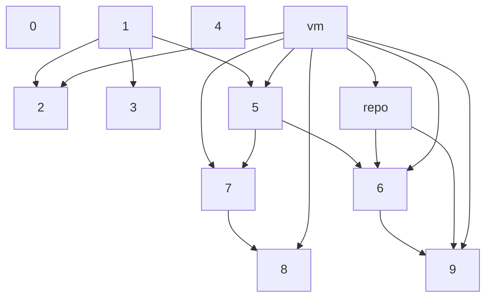

# Технологии программирования

## Организационные вопросы

1. Регистрационные данные (год поступления, группа, номер, Фамилия) фиксируются на момент регистрации и в дальнейшем не меняются, порядковый номер определяется по журналу, предоставленному на первое практическое занятие при регистрации пользователей, вне зависимости от отчисленных слушателей, изменений в журналах, данный номер будет в дальнейшем использоваться для определения вариантов выполнения задания, если иное не оговорено преподавателем.

1. Своему преподавателю нужно предоставить список группы в удобном ему формате. 

1. После регистрации в GitLab, к следующему после регистрации занятию необходимо подать в печатном виде таблицу, содержащую ФИО, слушателя, его fullname, username. В печатном варианте должна стоять подпись слушателя об ознакомлении с [правилами использования ресурса](https://gitwork.ru/root/help/-/wikis/%D0%9F%D1%80%D0%B0%D0%B2%D0%B8%D0%BB%D0%B0-%D0%BF%D0%BE%D0%BB%D1%8C%D0%B7%D0%BE%D0%B2%D0%B0%D0%BD%D0%B8%D1%8F).

1. В случае отсутствия слушателя на занятии он **обязан проработать материал самостоятельно**. Те задания, что слушатель не успел сделать на занятии, также остаются на самостоятельную проработку. На всех классах размещён порядок записи на самостоятельную работу в компьютерных классах.

1. **Не тяните до конца занятия** - демонстрируйте промежуточные этапы, выполнение отдельных пунктов заданий. В конце занятия может не хватить времени на всех.

## Материалы

1. Отдельные учебные материалы - презентации лекций, книги в электронном виде, вопросы к экзамену можно найти в **каталоге** `info` репозитория (выше).

1. [Полезные ссылки](https://gitwork.ru/root/help/-/wikis/%D0%9F%D0%BE%D0%BB%D0%B5%D0%B7%D0%BD%D1%8B%D0%B5-%D1%81%D1%81%D1%8B%D0%BB%D0%BA%D0%B8)

1. Некоторые вопросы, связанные с загрузкой репозитория, созданого вне данной системы управления проектами, проблемы с браузерами и средой разработки в **разделе** `wiki` (в меню слева).

1. Хорошее средство повысить свой уровень в знании Git и веток - [Learn Git Branching](http://gitwork.ru:5050/?locale=ru_RU)

1. Пример "хорошего" интерфейса, всего 4 страницы регистрации на сайте (никакие персональные данные не сохраняются) - \\\\fs\Iksi\k732\ТПро\UserInyerface\index.html

## Подготовка к занятиям по учебной дисциплине "Технологии  программирования"

1. Подтверждением усвоения материалов практического занятия является **самостоятельно** выполненное задание, результат которого загружен в личный репозиторий проекта. Возможна проверка на плагиат. Все причастные к плагиату могут получить дополнительное задание, снижение оценки или неудовлетворительную оценку по заданию.

1. Теоретические вопросы по теме задания входят в сдачу работы. Слушатель должен уметь развёрнуто отвечать на **рассматриваемые вопросы** и понимать все **термины, которые нужно усвоить**. 
 
## Сроки и плюшки

1. Практические навыки оцениваются путем выполнения заданий. На каждое задание выделяется определенное количество занятий. Текст задания фиксируется на момент начала соответствующего по теме занятия. При выполнении задания не в полном объеме отговорка "Задание скачано в начале семестра и потом не смотрел" - не принимается

2. Сдача задания на выделенных занятиях оценивается максимум "отлично", на последующем - "хорошо", далее "удовлетворительно".

3. Теоретические знания оцениваются оцениваются путем выполнения контрольной работы и тестирования на компьютере в виде "летучек". Контрольная работа проводится по всему теоретическому материалу, пройденному на момент контрольной работы. Летучки проводятся по отдельным темам и лекциям, по завершению изучения тем необходимо быть готовым на ближайшем практическом занятии к летучке.

3. Преподаватель-практик может вносить для своих подгрупп корректировки и дополнения в данные правила.

## Долгосрочное домашнее задание

Варианты и описание задания приведено в [файле](ddz/README.md)

Выбор варианта и фиксацию команды разработчиков необходимо произвести в issue текущего проекта, название issue соответствует номеру группы. [группа 7123](https://gitwork.ru/sub/tpro/-/issues/102), [группа 7321](https://gitwork.ru/sub/tpro/-/issues/103), [группа 7322](https://gitwork.ru/sub/tpro/-/issues/104),[группа 7323](https://gitwork.ru/sub/tpro/-/issues/105),[группа 7324](https://gitwork.ru/sub/tpro/-/issues/106), [группа 7325](https://gitwork.ru/sub/tpro/-/issues/107),[группа 7326](https://gitwork.ru/sub/tpro/-/issues/108).

С учетом того, что варианты команд разработчиков не должны пересекаться внутри учебной группы, вариант фиксируется за той группой разработчиков, которая первая отметилась в соответствующем issue.

Сроки:
* **1 октября** - формирование команды, выбор варианта, создание репозитория проекта, включение членов проекта и фиксация всей этой информации в issue выбора ДДЗ. В проекте необходимо добавить своего преподавателя и, дополнительно @anetto. При отсутствии самостоятельного выбора команды будут назначены преподавателем; 
* **15 октября** - представление информации от командиров групп - @anetto (информация должна содержать ссылку на репозиторий и список челнов проекта)
* **Последнее ПЗ ноября** - демонстрация ДДЗ-1;
* **Последнее ПЗ декабря** - демонстрация ДДЗ-2.

## Сдача задания

Любое задание можно сдавать удаленно (если иное не оговорено в самом задании или преподавателем).

Сдачу можно осуществлять через issue. Создайте issue "Сдача taskN", где N - номер сдаваемого задания. В этом issue необходимо оставить при необходимости требуемые по заданию комментарии и приложить скриншоты, показывающие полное выполнение задания. В случае большого количества скриншотов рекомендуется заранее (до сдачи) создать issuе и прикладывать к нему скриншоты по мере выполнения.

Как только задание будет выполнено, можно назначить это issue на преподавателя. Не назначайте issue преподавателю, если задание полностью не выполнено или не загружены все скриншоты. Как только issue назначено преподавателю, это означает, что вы начали процесс сдачи задания, в таком случае оценка уже будет зависеть от полноты выполнения задания и предоставления всех скриншотов.

После просмотра преподаватель может просто закрыть issue если задание принято, или вернуть issue вам с замечаниями. При ответе на замечания отвечайте после замечаний преподавателя, а не редактируйте исходный issue. После испраления замечаний назначьте его преподавателю.

## Задания

[Задание 0](task0.md). Входное тестирование.

[vm. Подготовка виртуальной машины](task_vm_prepare.md)

[repo. Настройка локальных источников обновления](task_repo_prepare.md)

[Задание 1](task1.md). Знакомство с GitLab.

[Задание 2](task2.md). Работа с ветками в Git через консоль

[Задание 3](task3.md). Командная работа в системе управления проектами. 

[Задание 4](task4.md). Сетевое планирование. 

[Задание 5](task5.md). Использование GitLab в среде разработки. 

[Задание 6](task6.md). Разработка графических приложений.

[Задание 7](task7.md). Кодирование ПО. 

[Задание 8](task8.md). Тестирование ПО.

[Задание 9](task9.md). Документирование ПО.

**Зависимости заданий**

В виде графа представлена зависимость (последовательность) выполнения заданий, а также возможная необходимость настройки виртуальной машины (vm) и настройки репозитория для обновления виртуальной машины (repo).

## Летучки

[Входное тестирование](http://gitwork.ru:5000/tpro/enter?pin=)

[Опрос в Задании 1](http://gitwork.ru:5000/tpro/pz0?pin=)

[Лекция 1. Жизненный цикл ПО](http://gitwork.ru:5000/tpro/l01?pin=)

[Лекция 2. Системы контроля версий (3 главы PROGIT)](http://gitwork.ru:5000/tpro/progit?pin=) 

[Лекции 4-5. Методологии разработки ПО](http://gitwork.ru:5000/tpro/l04-05?pin=)

[Лекция 6. Планирование разработки ПО](http://gitwork.ru:5000/tpro/l06?pin=) 

[Лекция 7. Проектирование ПО](http://gitwork.ru:5000/tpro/l07?pin=) 

[Лекция 8. ООП и UML](http://gitwork.ru:5000/tpro/l08?pin=) 

[Лекция 10. Кодирование ПО](http://gitwork.ru:5000/tpro/l10?pin=) 

[Лекции 11-13. Тестирование ПО](http://gitwork.ru:5000/tpro/l11-13?pin=) 

## Catch2
Различные особенности catch2 доступны [в документации](https://gitwork.ru/sub/src/catch2v3/-/blob/devel/README.md). Справка доступна в [catch-doc](catch-doc.md). 

[Презентация с примерами](info/Catch.pdf)

Если есть желание попробовать новую версию Catch2 - добро пожаловать в ветку проекта Catch2v3. Изменения коснулись разделения catch.hpp на два файла - hpp и cpp.

## Успеваемость 
\\\\fs\\Iksi\\k732\\ТПро\\...

