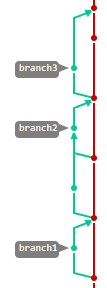

## Задание №1

## Знакомство с GitLab

### Зависимости: нет

Вы находитесь на сайте локально функционирующей системы управления проектами **GitLab**. Её доменное имя - **gitwork.ru**, URL-адрес для подключения - https://gitwork.ru, поэтому будем называть его gitlab или gitwork. Это альтернатива онлайн-ресурсу gitlab.com. Текущий GitLab развернут локально и не подключен к сети Интернет, доступ к нему может быть получен только из компьютерных классов. Локальный GitLab используется для решения следующих задач:
1. Получения материалов к занятиям. [Здесь](//gitwork.ru/root/help/wikis/%D0%9F%D0%BE%D0%BB%D0%B5%D0%B7%D0%BD%D1%8B%D0%B5-%D1%81%D1%81%D1%8B%D0%BB%D0%BA%D0%B8) приведён перечень дисциплин, которые уже адаптированы для gitwork.
2. Работы с кодом. Проект в GitLab - это либо типовая работа слушателя по дисциплине, либо самостоятельная работа в виде курсового  или дипломного проектирования. Большинство проектов закрыты по ряду соображений, но есть и открытые проекты. Например, такой [диплом](//gitwork.ru/Renzdby/GraphicalNewsExtractor). При использовании gitwork слушатель не привязан к конкретной аудитории и может работать на любом компьютере сети. Кроме того, возможна организация командной разработки.
3. Хранение результатов выполнения заданий в электронном виде и доступ к ним преподавателей.

Широко используемые сервисы для хранения кода онлайн это:
* GitHub
* Bitbucket
* GitLab

Фактически, GitHub сейчас стал социальной сетью для программистов, различные готовые решения и результаты своих разработок они выкладывают там для общего доступа. В июне 2018 года Microsoft купила GitHub  - это вынуждает искать альтернативы на тот случай, если github будет закрыт или изменится в негативном плане. 

Из представленных вариантов только у GitLab есть бесплатная версия для локальной установки без использования сети Интернет (так называемый self-hosted вариант). Это позволяет развернуть GitLab в любом подразделении, где есть локальная сеть. Принципы работы со всеми системами одинаковы.

GitLab - это многофункциональный продукт, который включает в себя
* систему управления проектами для системы контроля версий Git - пункт Repository на вкладке Plan и, например, пункт Merge requests на вкладке Code слева;
* вики-систему - пункт Wiki на вкладке Plan слева;
* систему отслеживания ошибок (bug-tracking system, известные примеры таких систем: Redmine, Bugzilla, Atlassian JIRA, YouTrack) - пункты Issues, Issue boards и Milestones на вкладке Plan слева;
* систему непрерывной доставки кода (continious integration/continious delivery) - вкладки Build, Deploy и Operate слева.

GitLab реализован на языках программирования Ruby и Go.

### Первые шаги в GitLab
1. Центральной сущностью GitLab является понятие **проекта**. Проект создаётся пользователем или группой и включает в себя множество файлов (под контролем системы контроля версий git), систему отслеживания ошибок (issues) и вики-систему. Вверху, под адресной строкой браузера, указана иерархия `Subjects - tpro - Repository`, то есть вы находитесь в репозитории проекта `tpro` группы репозиториев `Subjects`.

2. У каждого пользователя есть учётная запись (`username` при регистрации). Если `username` дописать в адресную строку после имени сервера, вы попадёте в профайл пользователя, например, [https://gitwork.ru/anetto/](//gitwork.ru/anetto/). Откройте эту ссылку в новой вкладке (<kbd>Ctrl</kbd>+<kbd>Левая кнопка мыши</kbd> или <kbd>Колесо мыши</kbd>). Посередине страницы вы видите `first name` (`fullname`) пользователя - выделено жирным, `username` после собачки @, дату его регистрации, графическую вкладку **Activity** - на ней цветными квадратиками отражена активность пользователя, а также просто вкладку активности **Activity**. Под активностью понимается число его действий по созданию, изменению или удалению текста в проектах. Во вкладке **Personal projects** вы можете увидеть созданные пользователем проекты. Для @anetto это репозитории по нескольким предметам. Зная имя пользователя и название его проекта, легко набрать полный путь [https://gitwork.ru/anetto/wiki/](//gitwork.ru/anetto/wiki/). 

3. Для создания проектов, не принадлежих конкретному пользователю, можно создавать группу. Например, текущий проект `tpro`, создан в группе `Subjects`. Для того, чтобы попасть в проект через адресную строку браузера, можно по аналогии с вышеописанными действиями для пользователя ввести адрес [https://gitwork.ru/sub/tpro/](//gitwork.ru/sub/tpro/). Обратите внимание, что вместо **subjects** для имени группы указано **sub** - это краткое наименование группы для указания в адресе. Аналогично для того, чтобы попасть на страницу самой группы, необходимо ввести адрес [https://gitwork.ru/sub/](//gitwork.ru/sub/). На странице группы показаны все проекты, принадлежащие ей.

4. В адресной строке браузера сейчас вы видите **https://gitwork.ru/sub/tpro/-/blob/master/task1.md**, состоящую из:
  * gitwork.ru - доменное имя локального сайта системы управлени проектами
  * sub - краткое имя группы 
  * tpro - название проекта
  * blob - тип отображения записи (например, `raw` для отображения без форматирования, `edit` для редактирования, `blob` при просмотре и другие)
  * master - ветка, для которой отображается файл (термин "ветка" вы узнаете позже при более детальном знакомстве с системой контроля версий git)
  * task1.md - название того файла, который вы читаете, в данном случае это файл с первым заданием на практическое занятие.

**Следующие действия производите в отдельной вкладке, не закрывая текущую**
1. Если вы еще не зарегистрированы, зарегистрируйте учётную запись, для этого перейдите по ссылке [https://gitwork.ru/users/sign_up](//gitwork.ru/users/sign_up) или же нажмите на гиперссылку `Register now` под большой синей кнопкой на стартовой странице [https://gitwork.ru](//gitwork.ru/), которая переадресуется на [https://gitwork.ru/users/sign_in](//gitwork.ru/users/sign_in). При создании учётной записи необходимо ориентироваться на сформулированные для Вашего же удобства [требования](https://gitwork.ru/root/help/-/wikis/Регистрация). Внимательно отнеситесь к правильности `first name` (`fullname`) и остальных полей. `First name` (`fullname`) служит для удобства других пользователей, которые видят вашу учётную запись. `Username` используется для входа в систему и участвует в формировании адреса проекта. **Не забывайте username и пароль**. В разных версиях GitLab поле `First name` именовалось `fullname`, поэтому в дальнейшем возможно применение и этого термина.

2. Создайте пустой проект `tpro` (`create blank project`: если в текущий момент времени у вас возникает wtf-вопрос, про что вообще речь и где искать соответствующую фразу, попробуйте отыскать в левом верхнем углу экрана символ gitlab, "оранжевая лисичка"; кликая на эту кнопку вы попадаете на начальную страничку с url https://gitwork.ru; в центре экрана будет заветный кликабельный квадратик с фразой, похожей на `create a project` - в разных версиях интерфейс изменялся, поэтому также можно встретить на начальном экране большую синюю кнопку с аналогичным названием; на следующей странице вы увидите заветную фразу), при создании проверьте, что стоит галочка `инициализации с файлом README`, чтобы такой файл создался ([инструкция по созданию проектов](//gitwork.ru/root/help/wikis/%D0%A1%D0%BE%D0%B7%D0%B4%D0%B0%D0%BD%D0%B8%D0%B5-%D0%BF%D1%80%D0%BE%D0%B5%D0%BA%D1%82%D0%B0)) в `gitwork.ru`. Не выбирайте других имен проекта, кроме `tpro`. Проект всегда можно переименовать, о том, как это сделать, написано в `wiki` текущего проекта. Обратите внимание, в инструкции указано, что необходимо добавить пользователей - уточните у преподавателя какого пользователя необходимо добавить, например, для пользователя @klexey требуется ввести его username **klexey** или fullname **kuznetsov_av**, и с какой ролью, например, **developer** (актуальная информация об учётных записях преподавателей для каждой группы содержится в [issue](https://gitwork.ru/sub/tpro/-/issues/110) проекта).

3. Изначально на странице проекта показан типовой пример файла `README.md`, который служит для описания проекта. В дальнейшем мы отредактируем данный файл. Некоторая вспомогательная информация о работе с git содержится в файлах [git_short.md](//gitwork.ru/sub/tpro/-/blob/master/git_short.md) или [git_full.md](//gitwork.ru/sub/tpro/-/blob/master/git_full.md) текущего репозитория дисциплины.

4. Отредактируйте файл `README.md`, если он не создан автоматически с проектом (сняли предлагаемую галочку), то создайте его: благо, в проекте справа есть кликабельная фраза `+ Add README`. Этот файл нужен другим людям для знакомства с текущим проектом. `README.md` автоматически показывается пользователю, который зашёл в репозиторий. Например, в текущем проекте в данном файле размещены организационные вопросы, ссылки на задания и любая другая полезная информация. Для проектов с открытым исходным кодом `README.md` содержит небольшое описание проекта, примеры использования, информацию о лицензии и многое другое. Файл `README.md` может быть создан для любого каталога проекта, в таком случае его содержимое будет отображаться при входе в данный каталог.

Для редактирования файла `README.md`:
* При нажатии на вкладку `Projects` в левой части экрана перед вашими глазами появится несколько вкладочек с такими названиями, как: Contributed, Starred.. Вам сейчас нужны проекты во вкладке Personal - те, что вы создали самостоятельно. Ожидается, что там вы увидите 1 проект с названием `tpro`, если вы ничего не напутали, разумеется. Открывая проект перед вами будет содержимое проекта - только один файл `README.md`
* Нажмите на файл - вы попадете в режим просмотра файла.
* Справа вверху нажмите на кнопку `Edit` и в выпадающем окошке выберите `редактирование отдельного файла` (`Edit single file`). Не рекомендуется открывать режим Web IDE - вы попадете в интерактивную среду разработки, имеющую б**о**льший функционал, чем нам сейчас необходим. Все дальнейшие рекомендации написаны для обычного режима редактирования.
* Откроется редактор - переходите к следущим действиям.
 
Для создания файла `README.md`:
* При открытии соответствующего проекта, требующего создания `README.md`, в правой части экрана вы увидите множество кликабельных инструкций: с большой вероятностью вы отыщите кнопку `+ Add README`, нажмите ее; если ее нет, то нажмите `+New file`, в зависимости от версии GitLab это может быть зеленая кнопка `New file` или кнопка плюс (посередине, где написан адрес), далее `new file` (новый файл);
* Ввести имя файла README.md;
* Откроется интерактивная среда разработки.
* Выполняйте дальнейшие действия (описанные для обычного редактора, по аналогии).

В содержимое файла вписать весь текст из таблицы ниже (первую строку нужно изменить в соответствии с написанным в ней информацией), ранее содержавшуюся информцию нужно удалить. Обращаем внимание на то, что требуется внимательно знакомиться с текстом файла, который вы создаёте: это, в частности, касается комментария **во втором абзаце**!
```text
**2017-3-07-iva Иванов**

# Выше впишите ваш first name (fullname), состоящий из года поступления, группы, номера по журналу, первых трех букв фамилии, а также фамилию, это позволит понять, кто является автором проекта и вам самим убедиться, что вы скачали и работаете со своим репозиторием, данный коментарий следует удалить.

## Это пример заголовка
    
Здесь могут быть написаны разные вещи. Поддерживается markdown разметка, отсюда и расширение .md
**Обратите внимание**, что это продолжение первой строки.

**А это строка вторая.** Это особенность языка разметки - **строки не отделенные пустой строкой**, при просмотре файла **склеиваются в одну**.

Есть списки
1. Как нумерованные.
1. Обратите внимание, что число "1" слева при отображении превратится в корректный номер.

* так и маркированные;
* и даже многоуровневые
    * второй уровень
        * третий уровень
```
    
Нажмите кнопку `Commit changes` (новые версии Gitlab), в `commit message` впишите "отредактирован README.md", нажмите `commit changes` или, если работаете в режиме IDE, сначала нажмите кнопку `commit`, а уже потом впишите информацию в `commit message`;

Посмотрите на отображаемое содержимое файла. Обратите внимание на корректную нумерацию в списке и другие изменения;

1. Работа со ссылками
    * Для созданного файла доступны кнопки `Edit`, под которой скрываются выпадающие кнопки `Open in Web IDE` (открыть в онлайн-редакторе среды разработки) и `Edit single file` (Редактировать отдельный файл в обычном редакторе), а также отдельные кнопки `Replace` (Заменить), `Delete` (Удалить). Режим Web IDE предназначен, в первую очередь, для разработки кода и его дальнейшей компиляции на серверах с последующим тестированием, сборкой и т.п. Такой режим работы не очень удобен для просто редактирования текстовых файлов, поэтому сейчас мы его использовать не будем, все дальнейшие действия и примеры описаны для режима редактирования, а не Web IDE, если вы будете его использовать, то готовьтесь к несоответствию написанного и увиденного.
    * Откройте файл README.md в режиме простого редактирования отдельного файла (`Edit a single file`).
    * Теперь работает подсветка синтаксиса markdown. Подробнее о синтаксисе markdown [тут](//gitwork.ru/help/user/markdown#wiki-specific-markdown);
    * Кроме того, вверху над окном редактирования можно выбрать режимы работы `Write` (редактирование) и `Preview` (редактирование с предпросмотром) - любые вносимые изменения будут отображаться в правом окне в том виде, в котором его увидит конечный пользователь.
    * **Обратите внимание на особенность** - если текст не является нумерованным или маркированным списком, то для перевода строки требуется двойное нажатие <kbd>Enter</kbd>!!! Сравните текст при редактировании и в самом файле.
    * Добавьте ссылку вида `Пример ссылки` на файл `README.md` в текст своего `README.md`. Ссылка на файл должна вести на **содержимое файла README**, а не в меню его редактирования. Эта ссылка, введённая на новой странице, должна загрузить файл `README.md` вашего проекта. (Например, из двух приведенных далее ссылок, одна ведет на файл (blob), а другая на окно его редактирования (edit) для **пользователя los** и его проекта tpro: https://gitwork.ru/los/tpro/-/blob/master/readme.md и https://gitwork.ru/los/tpro/-/edit/master/readme.md  
    Обращаем внимание, что пользователь **los** может не существовать в текущий момент времени - это лишь пример, как должна выглядеть ссылка на соответствующий файл README проекта: в вашем случае требуется добавить ссылки на **собственный** файл README.md в **собственном** репозитории
    * Формат для добавления ссылки
    ```text
    [текст для показа](сама ссылка)
    ```
    * После добавления ссылки вверху вкладку `Write` переключите на `Preview`, это покажет файл, как он будет выглядеть после окончания редактирования. Убедитесь, что ссылка отображается корректно;
    * В `commit message` впишите "добавлена ссылка на документацию" и нажмите `commit`;
    
1. Работа с ветками из web-интерфейса
    * Git позволяет хранить несколько веток проекта и работать с ними. Функционал веток допускает одновременное наличие разных версий файлов, среди которых можно переключаться. В обычной работе над ПЗ вам это может не пригодиться, но стоит попробовать эту возможность и использоавть ее в дальнейшем, например, при коллективной разработке.
    * **Ветка 1 - слияние при изменениях только в одной ветке**
        * Снова откройте для редактирования файл `README.md` и добавьте строку "Добавлено в ветке branch1" - **не забывайте про необходимость добавления пустых строк, чтобы строки не склеивались и предварительный просмотр при редактировании**.
        * При создании коммита вам будет предложено выбрать в какой ветке созранить изменения - `Commit to the current master branch`, то есть сохранить изменения в текущей ветке или `Create a new branch`, то есть - сохранить изменения в новой ветке. Выберите второй вариант и в текстовом поле замените предлагаемое название ветки (Target branch) на **"branch1"** (пробелы в названии ветки не допускаются), **уберите** галочку "start a new merge request" ("Начать новый запрос на слияние с этих изменений"). Нажмите `Commit changes`;
        * Вы создали новую ветку `branch1` проекта в дополнение к основной ветке `master`. Содержимое файлов в ветках может отличаться.
        * Теперь вы видите новую редакцию файла. Вверху есть выпадающий список, в котором отображается название ветки `branch1` или `master`. Этот список указывает на текущую ветку, с которой ведется работа. Переключение между ветками `master` и `branch1` меняет содержимое файла, то есть переключается на версии файла, соответствующую ветке `master` или ветке `branch1`. Таким образом, можно иметь две и более версии файла и легко переключаться между ними. При этом каждую из этих версий можно редактировать независимо, а при надобности - слить изменения вместе;
        * Если все выполнено верно, то отличия между файлами `README.md` веток `master` и `branch1` заключаются в наличии строчки "Добавлено в ветке branch1" в файле ветки `branch1`.
        * На левой вкладке в разделе `</> Code` (Код) выберите `Repository Graph` (Диаграмма) - вы увидите визуальное представление веток проекта, сейчас оно не такое наглядное, поскольку ветка `branch1` опережает ветку `master` на одно изменение. Указатель с названием веки указывает на то, где находится текущее изменение каждой ветки. Вверху можно выбрать текущую ветку, это может влиять на структуру отображаемого графа - выбранная ветка будет отображаться  как центральный ствол дерева, это станет более наглядно в дальнейшем при увеличении количества веток.
        * Произведем слияние веток, для этого в левой вкладке `</> Code` найдите и нажмите `Merge Requests` (Запросы на слияние). Git предоставляет возможность создавать запрос на слияние для только что выполненного изменения (сообщение вверху страницы, с последним изменением и указанием ветки `branch1` и предложением создать слияние - кнопка `Create merge request` или универсальное создание запроса для любых веток - кнопка внизу посредине экрана `New merge request`. Создайте новый запрос на слияние, выбрав одну из кнопок.  Если выбрали кнопку для создания слияния для последнего действия, то переходите к следующему пункту, если универсальную кнопку создания запроса, то необходимо выбрать ветки, которые будут сливаться - в одном выпадаещем списке (обычно справа) уже выбрана ветка `master`,  во втором окне выберите ветку `branch1`, и перейдите к сравнению веток и созданию запроса - нажмите кнопку `Compare branches and continue`.
        * В появившемся окне можно описать запрос на слияние, это необходимо для случаев, когда слияние подтверждает другой человек, чтобы ему было понятно текущее действие. Ниже в поле `Assignee` можно указать ответственное лицо за проведение слияния, данный человек должен являться членом текущего проекта. Сейчас это не будем изменять, поскольку вы единственный разработчик своего проекта и можете сами проводить слияние - нажмите кнопку `Create merge request` (запрос на слияние). Но слияние веток еще не произошло, **мы создали только запрос на слияние**.
        * В появившемся окне примерно посередине - кнопка `Merge`, и галочка "Delete source branch" ("Удалить ветку после слияния"). Галочку лучше снять, в противном случае информация о ветке `branch1` будет удалена и график будет выглядеть не так наглядно. После нажатия кнопки `Merge` произойдет слияние веток.
        * После слияния вернитесь в репозиторий, **убедитесь, что вы находитесь в ветке** `master` и посмотрите содержимое файла `README.md` - в нем добавилась строчка "Добавлено в ветке branch1". Если переключиться в графическое представление веток, то будет видно появление новой ветки, ответвляющейся от основного "ствола" и сливающейся обратно с ним. Необходимо отметить, что указатель на ветку `branch1` оставлен на прежнем месте (коммите), это означает, что изменения ветки `master`, если бы они происходили, в ветку `branch1` не попали. Нагляднее это будет видно в дальнейших примерах.
    
    * **Ветка 2 - слияние при пересекающихся изменениях в двух ветках**
        * В рассмотренном примере с веткой 1 производилось слияние двух веток, в одной из которых не было изменений, поэтому конфликта не возникло. Смоделируем ситуацию с конфликтом, когда файл изменен в двух ветках параллельно.
        * Добавьте в файл `README.md` **ветки** `branch2` (аналогичными действиями) строчку "Добавлено в ветке branch2" (не забудьте оставить пустые промежуточные строки, указать правильную ветку и снять метку "начать слияние" перед сохранением файла).
        * Переключитесь обратно на ветку `master` (новая строчка про добавление в ветке `branch2` должна пропасть) и добавьте в файл строку "Добавлено в ветке master" (пустые промежуточные строки!!!).
        * Сравните содержимое файлов в ветках `master` и `branch2`, а также проверьте визуальное представление - `Repository graph` (диаграмма).
        * Начните слияние веток `branch2` и `master`, после нажатия кнопки `Create merge request` вы должны попасть на страницу с сообщением "Merge blocked: merge conflicts must be resolved" - слияние заблокировано, присутствует конфликт слияния веток, который необходимо разрешить (от слов "решение", "решить"), поскольку изменения в файле произошли в одной и той же строке и конфликтуют между собой.
        * Нажмите кнопку `Resolve Conflicts` ("Разрешить конфликт") - отобразится содержимое файла `README.md` и конфликтующие строки - одна будет обозначена "our changes" - изменения текущей ветки (`branch2`), другая строка - "their changes" - изменения ветки `master`. Напротив каждой такой строки будет кнопка "Use ours" или "Use theirs", то есть какое изменение использовать. Выберете изменения ветки `branch2` и нажмите кнопку `Commit to source branch`.
        * Завершите слияние - зайдите в список запросов на слияние, выбрав в меню слева `Запросы на слияние` (Merge Requests) и найдите в списке последний запрос, нажмите кнопку `Merge`
        * Проверьте содержимое файла и посмотрите графическое отображение веток проекта. 
    
    * **Ветка 3 - слияние при непересекающихся изменениях в двух ветках**
        * Теперь смоделируем ситуацию, когда есть два неконфликтующих между собой изменения.
        * Файл `README.md` ветки `master` должен содержать две строки "Добавлено в ветке branch1" и "Добавлено в ветке branch2" (или master, если при разрешении конфликта была ошибочно выбрана другая ветка).
        * Изменим эти строки в разных ветках.
        * В строку с `"Добавлено в ветке branch1` добавим "изменено в ветке branch3" и сохраним в ветке `branch3` (не забыть ввести имя ветки и снять флажок с формирования запроса на слияние).
        * Вернуться в ветку `master` и в строку с `"Добавлено в ветке branch2` (или master) добавить "изменено в ветке master".
        * Сравните содержимое файлов веток и графическое представление веток.
        * Начните запрос на слияние веток `branch3` и `master`, конфликта не должно возникнуть, поскольку изменения затрагивали разные строки файла (если же вы забыли делать промежуточные пустые строки, то конфликт возникнет - вы попали в ситуацию аналогичную "Ветке 2", разрешите конфликт, как предлагалось в предыдущем пункте и выолните данный пункт заново, но уже с новым названием ветки `branch3_1`. Для дошедших до `branch3_2`,`branch3_3` и более будет сформирована доска почета).
        * После подтерждения слияния кнопкой `merge` оба изменения попадут в файл `README.md` ветки `master`. Можно в этом убедиться, посмотрев его содержание.
        * Посмотрите графическое представление веток проекта.
        * Обратите внимание, что содержимое ветки `branch3` не содержит фразы "изменено в ветке master", поскольку ветка `branch3` содержит только изменения, которые производились в этой ветке, а изменения ветки `master` содержатся только в ветке `master`.
        * **Проверьте состояние веток проекта через графическое представление - все ветки должны быть слиты с основной веткой `master`** 


    
    

3. Создание и выполнение `issue`. `Issue` - это задачи, тикеты или обсуждения в проекте. Предполагается, что любая разработка начинается с постановки задачи (формирования issue). К задаче можно писать комментарии, например, с уточнениями или вариантами решения задачи. К задачам относится как разработка нового функционала, так и устранение неисправностей (ошибок или т.н. багов).
    * Зайдите во вкладку `Plan` - `Issues` (обсуждения) **ВАШЕГО** проекта. Нажмите `New issue` (новое обсуждение) на экране.
    * В `Title` (заголовок) впишите "Отчет по заданию 1", в `Description` впишите "освоено создание проекта". Поддерживается разметка markdown, `Preview` позволяет посмотреть результат. Внизу есть ссылка на документацию по markdown.
    * В `Assignee` выберите себя. Перед завершением создания issue посмотрите на верхний левый угол экрана, где отображается значок Gitlab и аватар вашего поьзователя. Там не должно быть никаких цифр. (Если они есть, то значит были проблемы со слиянием, не все Merge Requests завершены или что-то еще не так с выполнением задания). Нажмите кнопку `Create issue` и ещё раз посмотрите в верхнее меню. Теперь появилась цифра 1  к пиктограмме `Issues` (самая левая) - значит, вы назначены исполнителем для какого-то задания. Нажмите на цифру - попадете в список issues (обсуждений), зайдите в это задание и с помощью кнопки `Close issue` отметьте его выполненным. Теперь после обновления страницы цифры у `Issues` в правом верхнем углу не будет. Рядом должна была появляться и также пропасть цифра 1 в списке поручений (ToDo List), куда автоматически попадают все issue, назначенные вам, а также некоторые другие события, требующие ваших действий (например, при указании вашего username с использованием символа @ в каком-нибудь доступном вам проекте - условно, ваш коллега мог дополнительно подсветить перед вами задачу (для ознакомления или проверки будущей корректности выполнения) при условии, что в качестве assignee указан ваш общий знакомый).
    * Закрытое `issue` остаётся в общей истории, помеченное закрытым. Для каждого `issue` можно вести обсуждение (например, для уточнения задания или проблемы).

### Опрос
1. В целях закрепления материала проводится опрос в виде тестов из 5 вопросов. На тест даётся 5 минут, ещё 1 дополнительная минута на отправку результатов. По окончании 6 минут результаты отправятся автоматически. Вверху страницы таймер на 5 минут, последняя минута считается отдельно и выделена красным.
2. В начале теста нужно заполнить данные о себе. Это год поступления, последняя цифра номера группы, порядковый номер по журналу (обязательно 2 цифры, слева дополнить нулём. То есть 01, 02, 11, ..), и фамилия на русском языке. К тесту приступать только после заполнения этих данных.
3. Проходить тест можно многократно, но оценивается только первая попытка, все предложенные вопросы рассматривались в данном задании.
4. Если готовы, то [приступить к опросу по GitLab](http://gitwork.ru:5000/tpro/pz0?pin=)

 
## Сдача задания

Для сдачи задания в **своем проекте** создайте `issue` "Сдача task1". (Убедитесь с помощью адресной строки браузера, в каком проекте вы находитесь, - например, это так, когда отсутствует иконка дисциплины в левом верхнем углу - что вы создаете `issue` именно в своем проекте )

Назначьте получателем (`Assignee`) для `issue` своего преподавателя.

Если `issue` будет закрыто, то задание принято, в противном случае преподаватель укажет замечания в `issue` и переназначит его вам - вы увидите в левом верхнем углу, что вас есть назначенное issue.
