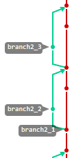
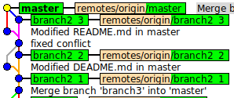

## Задание 2

## Работа с ветками в Git через консоль
## Работа с несколькими репозиториями одного проекта

###  Домашнее задание

Прочитать в книге **PROGIT** главы 1-3 (Введение, Основы Git, Ветвление в Git), можно использовать русский печатный вариант книги, доступный в бибилиотеке и в электронном виде: "**Чакон С. Git для профессионального программиста**", единственное отличие - первая глава называется "Начало работы", а не "Введение". Книги в электронном виде можно найти в **репозитории** в каталоге "info/Библиотека/Git".

### Зависимости: [Задание 1][task-1], [VM][task-vm].

Перед выполнением задания необходимо выполнить [настройку виртуальной машины для работы с системой управления проектами и клонирование своего существующео проекта в виртуальную машину](task_vm_prepare.md) (далее - ВМ)

Вы можете всегда использовать указанные инструкции для подготовки ВМ в новой аудитории или на новом компьютере.

Откройте терминал, вся дальнейшая работа будет выполняться в нем.

Необходимо перейти в каталог с вашим проектом, если вы делали все по инструкции, то путь к вашему проекту `'/home/user/Desktop/tpro'`

Узнать текущий каталог можно выполнив команду 
```bash
pwd
```
Если находитесь в другой директории, выполните команду для перехода в необходимый каталог:
```bash
cd ~/Desktop/tpro
```
Выполните последовательно две команды:
```bash
ls
cat README.md
```
На экране вы должны увидеть сначала список скачанных файлов вашего проекта, затем содержимое файла `README.md`, убедитесь, что выработаете со своим проектом по содержимому файла. 

### Работа с ветками через консоль

В данном задании будет выполнены все те же действия, что и в предыдущем [задании][task-1], отличие лишь в том, что в первом случае вы работали через веб-интерфейс системы управления проектами, а теперь будем работать с системой контроля версий через консоль.

Теперь давайте узнаем ветку, в которой мы сейчас находимся. Это можно сделать с помощью следующей команды:
```bash
git status
```
Результат должен быть примерно следующим, ..
```bash
On branch master
Your branch is up to date with 'origin/master'.

nothing to commit, working tree clean
```
.. что означает, что текущая ветка проекта - `master`, состояние проекта совпадает с состоянием проекта по условному адресу `origin` и веткой `master` там, а также, что нет никаких изменений, которые необходимо фиксировать (с помощью команды `commit`).

Узнать, что скрывается за условным адресом `origin`, можно, выполнив команду:
```bash
git remote -v
```
Т.к. мы работаем с существующим проектом, в котором по предыдущему заданию создавались ветки, то в нём уже существует 3 ветки кроме ветки `master`: `branch1`, `branch2` и `branch3`. 

Выполните команду, которая выведет ветки проекта
```bash
git branch
```
Должен появиться список веток. Звёздочка означает текущую выбранную ветку. Но почему в списке представлена всего 1 запись (`master`), а не 4, как мы ожидали? Потому что из репозитория забирается по умолчанию только одна ветка, в данном случае `master`.

В зависимости от версии `git` информация о ветках может выводится не просто в консоль, а как список: если вы видите `(END)` и никак не можете покинуть список, то нажмите <kbd>q</kbd> или <kbd>Ctrl</kbd>+<kbd>C</kbd>.

Теперь переключимся на ветку `branch1`.
```bash
git checkout branch1
```
Результат буде примерно таким, ..
```bash
Switched to a new branch 'branch1'
Branch 'branch1' set up to track remote branch 'branch1' from 'origin'.
```
.. что означает, что произошло переключение на новую ветку `branch1` и эта ветка подключена к одноименной ветке проекта с условным адресом `origin`. Можете проверить доступные ветки проекта командой `git branch`.

Аналогично теперь переключитесь на ветку `branch2` и `branch3`.

Переключитесь на ветку `master`.

Посмотреть графическое представление веток через консоль можно выполнив команду (указанные ключи делают вывод наглядным):
```bash
git log --oneline --decorate --graph --all
```
или
```bash
gitk
```
В последнем случае откроется отдельное окно `gitk`.

Выйти из режима отображения команды `git log` можно клавишей <kbd>q</kbd> или сочетанием клавиш <kbd>Ctrl</kbd>+<kbd>C</kbd>.

Обратите внимание, что при запуске `gitk` работа в консоли не может быть продолжена пока не закрыто окно `gitk`.

Теперь приступим к основным задачам задания - созданию веток через консоль (напомним, что задачи те же, что и в предыдущем задании):

* Слияние при изменениях только в одной ветке - конфликта не должно возникать
* Слияние при пересекающихся изменениях в двух ветках - необходимо разрешить конфликт
* Слияние при непересекающихся изменениях в двух ветках - конфликта не должно возникать

**Ветка 2_1 - слияние при изменениях только в одной ветке**

* Создадим ветку c именем `branch2_1`. Для этого выполним следующую команду: 
```bash
git checkout -b branch2_1 
```
Вывод будет следующим:
```bash
Switched to a new branch 'branch2_1'
```
* После выполнения данной команды мы работаем с новой веткой `branch2_1` и она является копией ветки `master`, включая текущий последний коммит, при любых последующих изменениях ветки `master` и `branch2_1` 'разойдутся'. Посмотрите текущее графическое представление веток командами `git log ...` c ключами, указанными выше, или `gitk`.

* Теперь откройте веб-интерфейс и посмотрите список доступных веток (Графическое представление `</> Code` - `Repository graph` или список веток `</> Code` - `Branches`). Ветка `branch2_1` ещё не отображается, потому что мы не сообщили серверу о внесённых изменениях. Это можно осуществить с помощью следующей команды:
```bash
git push origin branch2_1
```
В консоли вы увидите следующее:
```bash
Total 0 (delta 0), reused 0 (delta 0)
remote: 
remote: To create a merge request for branch2_1, visit:
remote:   https://gitwork.ru/username/tpro/-/merge_requests/new?merge_request%5Bsource_branch%5D=branch2_1
remote: 
To gitwork.ru:username/tpro.git
 * [new branch]      branch2_1 -> branch2_1
```
* Последняя строка нам сообщает, что ветка была успешно создана, теперь она доступна на выбор через веб-интерфейс. Проверьте этот факт.

* Откройте файл `README.md` с помощью текстового редактора. Это можно сделать с помощью следующей команды (здесь и далее будут приведены действия для редактора `nano`, при использовании другого редактора, используйте соответствующие команды и сочетания клавиш):
``` bash
nano README.md
```

* Добавьте в файл следующую строку: **Add in branch2_1**. Сохраните изменения в файле (<kbd>Ctrl</kbd>+<kbd>S</kbd>), закройте редактор (<kbd>Ctrl</kbd>+<kbd>X</kbd>). Все изменения, которые вы совершаете, производятся локально, удалённый сервер ещё ничего не знает о внесённых вами изменениях. Давайте сообщим серверу об этих изменениях.

* Не забывайте в процессе изменения файлов периодически выполнять команду `git status`, чтобы узнать текущее состояние проекта.

* Выполните следующие команды:
```bash
# Сообщаем системе контроля версий, что следует индексировать данный файл
git add README.md

# Зафиксируем изменения и подготовим к передаче на сервер
git commit -m "Modified README.md in branch2_1"

# Далее запросим изменения с сервера
# Может получиться так, что с веткой одновременно работает несколько человек и ваша локальная копия файлов отличается от актуальной копии данных на сервере
# Все изменения необходимо забрать для локального использования
git pull origin branch2_1

# Т.к. изменений на сервере не было, а внесённые нами изменения были добавлены в коммит, то изменений локальных файлов не произойдёт
# Осталось только отправить наши изменения на сервер
git push origin branch2_1
```

* После этого обновите веб-интерфейс, перейдите на ветку 'branch2_1'. Вы увидите, что теперь наши изменения отображаются на сервере. Обратите внимание, содержимое файла на сервере для веток `master` и `branch2_1` отличается.

* Теперь после фиксации изменений сольём две ветки: `master` и `branch2_1`. Т.к. мы хотим забрать изменения из ветки `branch2_1` в ветку `master`, то переключимся на ветку `master`. Это можно сделать с помощью команды 
```bash
git checkout master
```
* Теперь вы работаете с веткой `master` и можете **забирать** изменения. Это можно выполнить следующей командой 
```bash
git merge branch2_1
```
* Мы сообщили ветке `master`, что изменения надо забрать из ветки `branch2_1`. Теперь можно наблюдать, что в файле `README.md` появилась новая запись из ветки `branch2_1`. Проверьте это с помощью команды `cat README.md`. 

* Теперь необходимо сообщить серверу о внесённых изменениях в ветку `master`.
```bash
git push origin master
```
* Обновите веб-интерфейс. Вы увидите, что теперь файл `README.md` в ветках `master` и `branch2_1` совпадает.

Конфликта при слиянии не было.

Графическое отображение веток может не совпадать с вариантом предыдущего задания для ветки `branch1`, это означает, что система контроля версий не обнаружила изменений в ветке `master` и для экономии не создала новый коммит, а просто переместила указатель ветки `master` на место указателя ветки `branch2_1`.

**Ветка 2_2 - слияние при пересекающихся изменениях в двух ветках**

* Сейчас мы работаем в ветке `master`. Создадим новую ветку `branch2_2`. Это можно сделать с помощью команды 
```bash
git checkout -b branch2_2
```
Выполним команду `git status` и действительно увидим, что теперь работаем с новой веткой `branch2_2`. 

* Сообщим серверу о созданной ветке командой
```bash
git push origin branch2_2
```
Вы должны увидеть сообщение об успешно добавленной новой ветке.

* Внесём изменения в файл `README.md`, добавьте строку следующего содержания **Add in branch2_2**. Теперь добавим изменения на сервер (работаем светкой `branch2_2`).
```bash
git add README.md
git commit -m "Modified README.md in branch2_2"
git push origin branch2_2
```
* Теперь переключитесь на ветку `master` и добавьте туда запись следующего вида: **Add in branch master**. Отправьте измения на сервер, команды для указанных действиям аналогичны указанным выше, с указанием ветки `master`.

* Проверьте графическое представление веток проекта через консоль `git log ...` , `gitk` или через веб-интерфейс.

* Приступим к слиянию веток. Находясь в ветке `master`, выполним команду на слияние веток
```bash
git merge branch2_2
```
Вывод будет следующим, ..
```bash
CONFLICT (content): Merge conflict in README.md
Automatic merge failed; fix conflicts and then commit the result.
```
.. что означает, что в файле `README.md` обнаружен конфликт слияния и автоматическое слияние невозможно. Необходимо устранить конфликт, для этого откроем в редакторе файл `README.md` и увидим следующее:
```bash
Начало файла пропущено....

<<<<<<< HEAD
Add in branch master
=======
Add in branch2_2
>>>>>>> branch2_2
```

Место начало конфликта указывается с помощью `<<<<<<< HEAD`  
`HEAD` указывает на текущую ветку (`master`) и начало "конфликтных" изменений в этой ветке. Черта из знаков `=======` разделяет "конфликтные" изменения, все что до - принадлежит одной ветке, все что после - другой ветке. Снизу метка `>>>>>>> branch2_2` показывает место окончания "конфликтных" изменений и то, что конфликт был при слиянии с веткой `branch2_2`. 

* Разрешим конфликт, уберем знаки обозначения конфликта и оставим один вариант с `branch2_2`:
```bash
Начало файла пропущено....

Add in branch2_2
```
Как видно, в отличие от веб-интерфейса при разрешении конфликта через консоль можно внести дополнительные изменения, а не только выбрать один из начальных вариантов.

* Если вызвать команду `git status`, то можно увидеть информацию о текущем состоянии проекта: можно убедиться в том, что в проекте есть незаконченное слияние и изменения затрагивают теперь обе ветки, необходимо выполнить фиксацию изменений:
```bash
On branch master
Your branch is up to date with 'origin/master'.

You have unmerged paths.
  (fix conflicts and run "git commit")
  (use "git merge --abort" to abort the merge)

Unmerged paths:
  (use "git add <file>..." to mark resolution)
        both modified:   README.md

no changes added to commit (use "git add" and/or "git commit -a")
```
* Выполним фиксацию изменений и отправим их на сервер
```bash
git add README.md
git commit -m "fixed merge conflict"
git push origin master
```
Слияние веток `branch2_2` и `master` завершено.

**Ветка 2_3 - слияние при непересекающихся изменениях**

* Создайте ветку `branch2_3`, отправьте информацию об этом на сервер

* Измените файл `README.md` - в строке **Add in branch2_1** добавьте **and modified in branch2_3**. Сохраните файл и отправьте изменения на сервер с комментарием **README.md updated in branch2_3**.

* Переключитесь на ветку `master`

* Измените файл `README.md` - в строке **Add in branch2_2** добавьте **and modified in master**. Сохраните файл и отправьте изменения на сервер с комментарием **README.md updated in branch master**.

* Сравните содержимое файла `README.md` в ветках `master` и `branch2_3` (через консоль, переключаясь между ветками и выводя файл командой `cat`, или через веб-интерфейс)

* Проверьте, что находитесь на ветке `master`, и при необходимости переключитесь на нее.

* Проведите слияние с веткой `branch2_3`. Если вы выполните просто команду `git merge`, то система попросит вас ввести комментарий к коммиту, открыв редактор по умолчанию, в нем уже будет сообщение **Merge branch branch2_3**, можете не вносить изменений просто закройте редактор (если это редактор `nano`, то <kbd>Ctrl</kbd>+<kbd>S</kbd>, <kbd>Ctrl</kbd>+<kbd>X</kbd>, но, возможно, это редактор `VIM`, тогда нажав клавишу <kbd>Shift</kbd> и, не отпуская ее, два раза нажмите <kbd>Z</kbd> - будем проще называть это `Shift-Z-Z`)

Избежать работы с редактором можно, если изначально передать сообщение команде `merge`:
```bash
git merge -m "Merge branch branch2_3" branch2_3
```
На экране вы должны увидеть следующий вывод:
```bash
Auto-merging README.md
Merge made by the 'recursive' strategy.
 README.md | 2 +-
 1 file changed, 1 insertion(+), 1 deletion(-)
```

* Отправьте изменения на сервер:
```bash
git push origin master
```

* Если ошибок не было допущено, то слияние должно было пройти без конфликта

* **Проверьте итоговое состояние проекта через веб-интерфейс или консоль - все ветки должны быть слиты с основной веткой `master`**





## Работа с несколькими репозиториями одного проекта

Проект может находиться у различных пользователей или у одного пользователя в различных репозиториях, на различных серверах и т.д. Ведь git - это децентрализованная система контроля версий.

Для возможности синхронизации репозиториев между собой используются команды `push`, `pull` и т.п., а также краткое условное наименование месторасположения репозитория. Сейчас вы работаете с условным наименованием `origin`, это наименование репозитория по умолчанию, аналогично тому, что для веток по умолчанию используется наименование `master` (`main`).

Как было приведено в начале задания, посмотреть список местоположений репозиториев можно командой `git remote -v`. Обратите внимание, что каждый репозиторий выводится дважды - это адреса "куда/откуда", то есть куда отправлять изменения и откуда забирать изменения, в большинстве случаев они совпадают. 

#### Научимся работать с несколькими местоположениями текущего проекта (репозитория).

* Создайте у себя в системе управления преоктами (через веб-интерфейс) новый **пустой** проект tpro2 (проект не должен содержать никаких файлов, даже `README.md` - напоминаем, что для этого при создании репозитория в браузере нужно снять соответствующую галочку).

* Добавьте через консоль в свой текущий проект альтернативное метоположение (только, что созданный проект) с условным наименование `origin2`  командой

```push
git remote add origin2 ssh://git@gitwork.ru/ваш_юзернейм/tpro2
```

* Проверьте, что альтернативное месторасположение проекта появилось в списке (`git remote -v`).

* Отправьте ваш проект в альтернативный репозиторий командой

```bash
git push origin2 master
```

* Посмотрите в консоли графическое отображение веток и коммитов (`gitk` или `git log ...`) - в самом верху вы должны видеть, что на последний коммит указывают ветки `master`, `remotes/origin/master` и `remotes/origin2/master`. Можно понять в какой стадии изменений находятся все три репозитория - в настоящий момент они все синхронизированы в ветке master. Если указатели будут находиться в разных коммитах, то это значит, что репозитории не синхронизированы и при необходимости можно применять команды `push`, `pull` и т.п. По сути это все указатели, которые указывают на конкретный commit в проекте и, думая о ветках, метках, как об указатялях, проще понять принцип работы системы контроля версий.

* Посмотрите через веб-интерфейс проекта `tpro2` графическое отображение веток - вы должны видеть только ветку `master` и безымянные ветки, которые слиты в ветку `master`. При перемещении, синхронизации переносятся все изменения, которые входили в текущую ветку, поскольку у нас были слияния с другими ветками, то изменения этих веток тоже перенеслись.

* Синхронизируйте с `origin2` ветки `branch2` и `branch2_2`. Для этого сначала переключитесь на эти ветки, затем сделайте `push`.

* Вернитесь на ветку `master`


## Сдача задания

Для сдачи задания в **своем проекте** создайте issue "Сдача task2" и приложите туда скриншоты:
* графического представления веток из веб-интерфейса проекта **tpro**
* графического представления веток из веб-интерфейса проекта **tpro2**
* графического представления веток из консоли (`git log` или `gitk`)

Скриншоты должны включать по времени участок проекта, посвященный текущему и предыдущему заданию (то есть участок со всеми шестью ветками, которые создавались в этих заданиях). 

Назначьте получателем (**Assignee**) для issue своего преподавателя.

Ждите возврат issue от преподавателя с замечаниями или с подтверждением выполнения задания и возможностью перехода к финальной части - удалению временного проекта

Для этого:
* Находясь в проекте **tpro2**, перейдите в `Settings` - `General`
* Откройте раздел `Advanced`
* Нажмите кнопку `Delete project`
* Следуйте указаниям по вводимой информации и подтвердите действие

Назначьте получателем issue преподавателя и укажите в комментариях, что удалили временный проект и завершили задание.

Если issue будет закрыто, то задание принято, в противном случае преподаватель укажет замечания в issue и переназначит его вам.


[task-1]: task1.md
[task-vm]: task_vm_prepare.md
