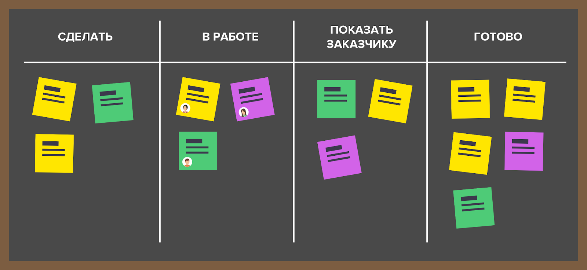

## Задание №3
## Командная работа

### Зависимости: [Задание 1][task-1].
### Лирическое отступление
При разработке программных продуктов широко распространена практика командной работы. Небольшие программы возможно разработать в одиночку, но требования по скорости разработки и объёму функционала зачастую диктуют необходимость участия нескольких специалистов в различных областях знаний. Программист и дизайнер - это уже команда из двух человек, которым необходима коммуникация. С увеличением числа задействованных специалистов возрастают требования к инструментарию, облегчающему взаимодействие.

Пофантазируем — представим, что вы разрабатываете IT-продукт по продаже **корма для собак**. На данный момент вы в команде один. Что вы будете делать в первую очередь? Вы задались идеей и, вполне вероятно, что даже составили небольшой и довольно грубый план. Вы решаете, что вам необходимо приложение под платформу Android, так как вы прекрасный специалист в области мобильной разработки на Android (а почему бы и нет). Спустя несколько долгих месяцев работы, оказывается, что вы даже немного смыслите в дизайне и ваше приложение выдалось вполне удачным. Вы получили первых клиентов (а может и не получили) и осознали, что больш**а**я часть потенциальных клиентов "обитает" на платформе iOS. Что вы будете делать теперь?

Что ж, вы прошли через многое и считаете, что изучить язык программирования Swift и новую платформу для вас совсем не проблема. Вы тратите ещё какое-то время на это и вуаля! У вас есть приложение по продаже корма для собак под две основные платформы, и теперь дела должны идти в гору, как никогда раньше. Но... как обычно, всё не так гладко. Оказывается, что пока вы реализовывали приложение под iOS, пользователи на Android начали стремительно понижать рейтинг приложению из-за множественных ошибок и багов. Теперь вы не спите ночами, исправляя все баги и уверяя пользователей, что теперь всё работает прекрасно...пока ваше приложение на iOS вдруг не упало. 

Хорошо, просидев за разработкой ещё какое-то время, вы сделали приложение довольно стабильным. Теперь пора расширяться, ведь конкуренты не дремлют: они сделали себе прекрасный сайт, в связи с чем их количество клиентов существенно выросло! Вы тоже хотите себе сайт, но кто его сделает? Вы не успеваете исправить все баги на мобильных платформах, так ещё и собираетесь сайт сами разрабатывать? Наконец, вы осознаете, что вам нужна помощь **специалиста в разработке web-сайтов**. Вам нужен кто-то, кто будет следовать той же цели, что и вы, забрав у вас сравнительно большую зону ответственности. Теперь вы приветствуете нового члена вашей команды, который будет отвечать за web-разработку и частично заберет на себя проблемы с продвижением продукта.

Теперь у вас есть приложение под две мобильные платформы, ваш web-сайт и **команда из двух человек** — что дальше? Вы **расширяете** ассортимент. Теперь вы продаёте корм для кошек, хомяков, птиц и т.д. У вас появилось огромное количество данных о поставщиках, продажах, продуктах и даже о покупателях! Вы всё ещё храните данные в одном файлике? Теперь нет. Вы нанимаете в команду **специалиста по базам данных**. **Команда расширилась до трех человек**. Данных стало в разы больше, но и то, как это работает, вас теперь тоже не волнует — для этого есть свой специалист. Вас волнует лишь то, что обращения к вашей базе должны быть максимально быстрыми, а данные не потерялись в случае непреднамеренного сбоя.

Пройдут годы, ваш продукт расширится максимально: вы наймёте **аналитиков**, чтобы предлагать покупателям товары, которые наверняка им подойдут (рекомендательные системы); вы наймёте **дизайнеров**, чтобы улучшить внешний вид ваших приложений; вы наймёте **тестировщиков**, ведь кто-то должен ещё, помимо клиентов, проверять насколько плохой у вас программный продукт; вы будете нанимать всё **больше и больше сотрудников**, расширяя способности и сферы деятельности вашего продукта. Вы будете продолжать это делать, если это будет способствовать успеху вашего продукта.

Что по итогу? Просто вспомните, с чего вы начали. Совсем редко, когда успешные продукты создаются и поддерживаются одним человеком. Вы не всесильны, поэтому вы просто **обязаны** научиться разделять задачи и работать в команде, состоящей из специалистов различных областей.

### Основная часть

Большинство программных продуктов используют специальные разработанные средства и методологии для ведения удобной, масштабируемой и эффективной командной разработки.

> **Совет**: почитать про Agile и Scrum и соответствующие системы ведения проектов и отслеживания ошибок, к примеру, 
> YouTrack и Jira.

В текущем задании мы упростим процесс ведения проектов до использования только одной системы управления проектами GitLab, с которой вы уже знакомы. Это не говорит о том, что различные описанные средства не используются в командах из 2-3 человек (скорее наоборот, в основу фреймворка Scrum, 
поддерживаемый, к примеру, Jira, легла идея небольших команд из 3-9 человек), однако для работы в текущих реалиях этого 
более, чем достаточно.

GitLab поддерживает основные инструменты ведения командной разработки: 
* **issues** - задачи, по разработке кода или исправлению ошибок и т.п.
* **MR** (merge requests) - запросы на слияние - внесение подтвержденных изменений в проект
* **ветки** (branches) - разделение проекта на различный функционал или тестирование отдельных возможностей до внедрения в основной проект
* и даже подобие **Kanban-досок**, часто используемые в командной разработке для наглядного отображения процесса разработки

### Цель
В этом задании необходимо изучить основные аспекты работы с ветками, issues и merge requests, а также канбан-досками на основе issues в GitLab, применяя это всё в командной разработке.

### Ход занятия

1. Создайте в своем текущем **личном проекте tpro** каталог `task3`, здесь будет вестись работа над данным заданием, помещаться редактируемый код и другая информация, относящаяся к заданию. Для удобства сразу создайте issue "Сдача task3", но не назначайте его преподавателю. Помещайте в него скриншоты, относящиеся к выполнению задания, и как только задание будет выполнено, назначьте issue преподавателю.

2. **Задача 1**. Перед началом работы вам **необходимо** добавить в свой проект **следующего по списку** слушателя (`n+1`), с учетом посещаемости занятия, возможно, это будет (`n+2`) и так далее, с которым вы будете пробовать командную работу над проектом. Вашего одногруппника необходимо добавить с правами **Developer** (подробнее о ролях в проекте можете почитать по ссылке рядом с назначением роли), чтобы он мог создавать MR-запросы (Merge request). Не волнуйтесь, что он может что-то изменить в вашем проекте: любые изменения в репозитории будут видны в коммитах. На **скриншоте** показать всех членов вашего репозитория (`Manage -> Members`). 
   
3. **Задача 2**. Аналогично **Задаче 1** проверьте, что **предыдущий по списку** слушатель (`n-1`) добавил вас в свой проект с правами **Developer**. Это потребуется для дальнейшего выпонения задания. На **скриншоте** показать всех членов репозитория слушателя (`n-1`), где видна ваша роль (`Manage -> Members`). 

4. Теперь, когда у вас с вашим напарником есть настроенный проект, давайте поговорим о том, как следует вести совместный проект и как принято их вести в современном IT-мире. Мы будем проводить некую параллель с часто используемой в IT-проектах методологией **Agile**, чтобы вы могли действительно осознать, что мы не занимаемся абстрактными ненужными вещами. Естественно, всё изложенное в этом задании является некоторым упрощением реальных процессов обсуждения проблем, ведения репозиториев, процессов руководства командой и т.п., но даже это достаточно для того, чтобы **разумно** вести командную разработку.
   
5. Итак, вернемся к [началу](#лирическое-отступление) и вашему зоомагазину. Допустим, у вас уже имеется Android-приложение и сейчас вам нужно предугадать некоторые пожелания ваших клиентов или, возможно, подумать, какой функционал вы хотели бы добавить в приложение. В Agile и Scrum подобные пожелания принято называть **пользовательскими историями**, а то, куда эти истории помещают, - **бэклогом**. По-простому, это подобно случаю, когда вы продумываете на человеческом языке функции, которые должна выполнять ваша программа, и записываете все ваши мысли (пользовательские истории) в специальный блокнот (бэклог). Впоследствии при разработке программного средства вы выбираете нужные вам истории в порядке приоритета исполнения из вашего бэклога и превращаете их в формализованное задание.Формализованное задание переводит простые мысли и пожелания клиента (те самые пользовательские истории) в удобный и понятный для разработчика язык: в задании чётко пишется то, что необходимо сделать конкретному разработчику; за какой срок; в каком виде и т.п. Очевидно, что одна пользовательская история может подразумевать сразу несколько заданий. К примеру, история "Добавить возможность оставлять отзыв о товаре" может подразумевать сразу несколько заданий: "Разработать дизайн окна отзывов", "Добавить таблицу отзывов в базу данных", "Реализовать диалоговое окно отзывов" и т.п., - каждое из которых назначается **своему отдельному** исполнителю в **команде разработки**.
   
6. В GitLab нет поддержки бэклога, пользовательских историй и заданий в удобном виде, потому что для этого есть специальные средства типа Jira (которое, кстати, интегрируется с GitLab и позволяет с лёгкостью взаимодействовать между этими двумя продуктами). Однако, функционал **Issues** и **Kanban-досок** (`PLan -> Issue Boards`) практически полностью могут покрыть этот недостаток.
   
   > Перед тем, как перейти к следующему пункту, важно уточнить, что бэклог используется в т.ч. для так называемых **спринтов**.
   > И на самом деле, процесс использования всех этих технологий куда сложнее. Но для этого, опять же, необходимо подробнее ознакомиться со Scrum и Jira.
   
7. Откройте вкладку `Plan -> Issue Boards` слева на панели проекта. Перед вами подобие **Kanban-доски**, которая используется для удобного распределения заданий по их состоянию. Сейчас, скорее всего, у вас только два столбца **Open** и **Closed**, в которые GitLab автоматически помещает открытые и закрытые issues. 
   
   В реальных проектах такие Kanban-доски используются постоянно, разве что в Jira они конкретно предназначены для заданий, а не issues, как в GitLab, но логика абсолютно та же. Доски нужны для того, чтобы руководителям проекта, а также членам проекта было удобно наблюдать за состоянием дел по его разработке. На доске отображаются задания, которые ожидают начала работы, находятся в работе, на code review (отмечены разрабочиками как сделанные и ожидают проверки качества исполнения местным руководителем), на тестировании, завершённые и т.д. Количество таких столбцов варьируется от проекта к проекту и полностью определяется **рабочим процессом** задач — это некоторый конвейер, через который проходит любая задача от начала (колонка "Ожидает начала работы") и до конца (колонка "Завершена"). Рабочий процесс можно полностью изменить — этим занимается руководитель проекта.
   
8. На рисунке представлен самый простой схематичный пример Kanban-доски. **Бэклогом** мы по сути можем называть то, что определено в столбце "Сделать". Важно только помнить, что бэклог — это всё-таки перечень задач, расположенных в порядке важности, для команды разработчиков, а на Kanban-доске такие задачи не всегда располагаются именно по приоритету. 
   Для простоты давайте считать бэклогом просто "список дел" по всему проекту, упорядоченных по приоритету, а столбец "Сделать" на доске, в свою очередь, может содержать ещё и другие **сопутствующие какой-либо истории из бэклога** задания.

   

9. Сейчас на вашей Kanban-доске всего два столбца. Вы всегда можете изменить количество столбцов, добавив новые. Однако GitLab создаёт столбцы только на основе **меток** (labels) у issues проекта. Поскольку изначально у вас нет ни единой метки, создать новые колонки у вас не получится.
   
   **Задача 3**. Создайте метки **backlog**, **code review** и **bug** (меню `Manage -> Labels`):
   * первая метка **backlog** понадобится для реализации бэклога, описанного ранее
   * вторая метка **code review** нужна для тех issues, которые вы создаёте, желая, чтобы ваш участок кода был проверен кем-то из ваших членов проекта (обычно этим занимается Team Lead проекта или иной старший разработчик)
   * третья метка **bug** нужна для тех issues, которые говорят о наличии ошибки (bug) в каком-либо участке кода
   
   Выберите для каждой метки свой цвет и добавьте описание, что значит конкретная метка. Создайте **новую** Kanban-доску (`Plan -> Issue Boards`), назвав её вашим **firstname (fullname)** (близко к левой панели есть **выпадающее меню** вероятнее всего с текстом "Development" рядом с поисковой строкой "**Search**", в выпадающем меню нажать на **Create new board**). Создайте на ней 3 новых столбца, связанных с созданными ранее метками (в правой верхней части кнопка **Create list** (всего у вас должно быть 5 столбцов).
   
10. Итак, теперь у вас есть своя собственная Kanban-доска, на которой вы с вашим напарником можете вести совместную разработку через issues. Теперь вкратце разберем и попрактикуемся на каждой отдельной метке. Начнём с **бэклога**.
   
   Ниже представлено несколько вариантов возможных приложений:

   1. Мобильное приложение для зоомагазина
   2. Мобильное приложение для ставок на спортивные события
   3. Мобильное приложение для онлайн-магазина одежды
   4. Сайт для анонимного общения
   5. Десктоп приложение для ведения проектов команд разработки
   6. Телеграм-бот для поиска книг
   7. Сайт для онлайн-курсов
   8. Приложение на смарт-часы для сна
   
   **Задача 4**. Ваш вариант: `<номер_по_списку> % 8` (исключение — для 8-го, 16-го и т.д. — это 8-й вариант). Теперь уточните вариант одногруппника, идущего **перед** вами по списку (`n-1`), и составьте **3 пользовательских истории** с меткой **backlog** в его проекте для его приложения: опишите то, что вы хотели бы видеть как **клиент**. Перейдите в ваш **собственный** проект и посмотрите на доску: если ваш напарник (`n+1`) сделал всё правильно, то вы должны увидеть 3 открытых issues с меткой **backlog** на вашей доске. Вы можете перейти в каждую из открытых issues и ответить на них. **Важно** не забыть при создании issues вашему напарнику назначить роль исполнителя (поле **assignee**) на **него**. На **скриншотах** необходимо показать Kanban-доску **слушателя** (`n-1`), на которой видны ваши issues, а также сами issues и их содержимое. 
   
   **Задача 5**. Теперь создайте **собственный** issue, в которой попробуйте более чётко формализовать требования к вашему приложению (возьмите одну из 3-х историй, которые вам прислали). Не забудьте закрыть issue с меткой **backlog**, которую вы трансформировали в открытый issue. Теперь у вас на доске должно быть открыто 1 issue, 2 - в поле **backlog** и 1 - в поле **closed** (имеются в виду issue, относящиеся к текущему заданию, возможно наличие закрытых issue от предыдущих заданий). Вы можете представить, что вы закрыли одну из задач и спокойно перенести вашу issue из поля **open** в поле **closed**. На **скриншотах** необходимо показать **вашу** Kanban-доску, на которой уже есть одно закрытое issue, а также показать описание созданного вами нового **issue**.
   
   Теперь должны иметь примерное представление о работе с **задачами** и бэклогом, непосредственно использующиеся при любой командной разработке. **Важно понять**, что на самом деле никто, конечно, меток **бэклог** не создаёт. Но при всём этом, правила ведения вашего проекта вы устанавливаете сами. Поэтому, вы вольны творить всё что угодно, лишь бы это было удобно всем членам команды.
   
11. Работа с Kanban-досками и issues, естественно, довольное интересное занятие, но в командной разработке есть и другие важные средства для достижения общей цели. Сейчас мы поговорим о запросах на слияние (**Merge requests**) и то, зачем они нужны.

   Представим, что вас обязали разработать или переработать какую-то часть вашего общего приложения. Вы создали отдельную ветку в репозитории с соответствующим названием, потратили какое-то время, выполнив задание, а сейчас хотите внести изменения в существующий проект, тем самым "слив" вашу ветку с веткой `master` или `main` (раньше все главные ветки по умолчанию назывались `master`, но волна "толерантности" добралась даже до этого). Что будем делать — просто сольём ветки? Боюсь, что такого вам в реальных проектах сделать не позволят (хотя бы потому что обычно изменения в мастер-ветку могут вносить только определенные разработчики), а вот запрос на слияние (`merge request`) вы создать всегда сможете!
   
12. Итак, зачем же всё-таки нужны MR? Если вкратце, то для того, чтобы вы с командой разработки могли обсудить изменяемый в главной ветке код, как-то его прокомментировать, найти проблемы и изъяны, а затем решить — вносить изменения или нет. То есть формально MR используется для некоторого рефакторинга (изменения) кода — вносятся новые участки кода или изменяются старые.
   
   > **Важно** сказать, что в GitLab запросы на слияние принято называть "Merge request", в то время как в GitHub и BitBucket 
   > установлено название "Pull request" (или PR). Естественно, концептуально они никак не отличаются. 
   > Вы можете называть их как угодно. В рамках задания мы будем говорить конкретно о Merge requests, поскольку мы работаем с GitLab.
   
   Всю процедуру работы с MR условно можно представить в виде такой последовательности действий:  
   
   1. Получение нового задания на изменение какого-то участка кода или функционала (в виде новой issue)
   2. Создание новой ветки для внесения изменений
   3. Внесение изменений и "push" в эту ветку
   4. В web-интерфейсе создаём MR и запрашиваем слияние вашей ветки в ветку основной разработки (обычно master)
   5. Обсуждаем слияние с членами команды разработки, получаем от них некоторый ответ (в виде комментариев в MR к конкретным строчкам кода или всему MR в целом)
   6. Отменяем слияние (при этом сам MR остаётся открытым, если командно не было принято решение отвергнуть предлагаемые изменения и изменить статус MR на closed) и делаем правки, которые обсудили на 5-м шаге, в нашей ветке
   7. Шаги 4-6 повторяем до тех пор, пока слияние не будет разрешено
   8. Принимаем MR и удаляем созданную ветку разработки (путём выбора галочки delete branch при слиянии)

   Иногда работа над конкретным изменением, например, корректировкой какого-нибудь бага, может занимать дни плодотворного обсуждения в MR целой группой заинтересованных сторон. **Важно** отметить, что MR также ценны тем, что сохраняют в себе (если вы в проекте, конечно, не балуетесь удалением объектов, таких как issues или MR) всю историю вносимых изменений: проглядев записи конкретного MR, можно проследить, что кем и когда делалось для общего блага

13. **Задача 6**. Теперь давайте запросим нашего напарника по проекту (`n+1`) помочь нам с рефакторингом. Анонсируем задание: необходимо будет воссоздать общение с вашим напарником через механизмы Gitlab, для этого нужно будет загрузить в репозиторий некоторый файл (его содержимое обсудим чуть позже), создать соответствующую issue с описанием, как отыскать этот файл и что нужно сделать напарнику, загрузку файла нужно будет оформить в рамках созданного MR в отдельной ветке проекта, далее же ваш напарник выдаст вам замечания в рамках созданного MR, а вы на них отреагируете

   Итак, **создайте** issue с меткой **Code review**, поставьте его исполнителем (атрибут **Assignee**), а в issue опишите, где будет лежать файл, который нужно будет проанализировать вашему напарнику (ожидается, что вы создадите в корне репозитория каталог **task3**, внутрь которого положите файл с некоторым названием). Сделайте **скриншот** созданной **вами** issue в своем проекте, где видны метка (label), описание issue (description) и исполнитель (assignee) - напарник (`n+1`)  
   Далее **создайте** новую ветку с названием "N-firstname" (или "N-fullname", в зависимости от версии GitLab), где `N` - это номер issue для автоматической связи MR и задачи (номер конкретной issue можно отыскать на панели `Plan -> Issues` в списке всех созданных issue, обращать внимание нужно на число после знака `#` для нужной issue), наследуясь от **основной** ветки вашего проекта (скорее всего `master`, если вы дополнительно ничего не настраивали). Создание ветки можно выполнить либо с использованием веб-интерфейса Gitlab, либо с использованием консольных команд git  
   После создания ветки **оформите** новый MR панели слева (очевидно, что в MR необходимо предложить слияние только что созданной ветки с основной веткой проекта). Отметим, что при создании MR рекомендуется не снимать галочку с `Mark as draft`, чтобы дополнитеьно подсветить, что на текущий момент MR всё ещё находится в работе: до момент удаления этой метки в начале заголовка MR слить изменения будет запрещено  
   После оформления MR **загрузите** файл (о котором вы уже анонсировали напарнику в issue) с любым реализованным вами кодом в каталог task3 в корне репозитория (можно использовать участок программы, подготовленной вами на вводном занятии, или же подойти к вопросу творчески и предложить новый код или разместить в репозитории небольшой текстовый файл с текстом некоторого произведения - стихотворения или кусочка романа - с ошибками, которые неминуемо должен исправить ваш коллега). Добавление файла, очевидно, нужно оформить отдельным коммитом или совокупностью коммитов (если файл большой), так будет выглядеть даже лучше
   После добавления файла необходимо **убедиться**, что в созданном Вами MR на вкладке `Commits` теперь появилось несколько ваших только что сделанных коммитов, а на вкладке `Changes` отображается содержимое добавленного вами файла. Теперь назначьте MR на вашего напарника (по аналогии с полем **assignee** в issue)  
   Сделайте **скриншот** с вкладки `Overview` открытого запроса на слияние ваших наработок в своём проекте, где видны ваши коммиты для добавления файла и исполнитель задачи (assignee) - напарник (`n+1`)
   На этом ваша работа до внесения комментариев напарника закончена

14. Ваш напарник (`n+1`) **должен** отыскать ваш MR, оформленный на него, и "высказать" свои замечания по поводу содержания добавленного вами файла в каталог task3 в корне репозитория

   Для этого он должен перейти на вкладку `Changes` и **отыскать** строки, к которым у него есть замечания, и **оставить** на каждую такую строку комментарий. Для того, чтобы сформировать комментарий, необходимо **навести** на интересующую вас строку и обратить внимание на кликабельную пиктограмму сообщения слева от выбранной строки (при наведении на неё вы увидете сообщения с примерным содержанием - в зависимости от версии Gitlab может меняться - `Add a comment to this line or ..`). **Нажмите** на эту пиктограмму напротив комментируемой вами строки и в появившемся ниже блоке ввода текста опишите, что вы предлагаете исправить в строке. После написания сообщения **выберите** ниже кнопку `Start a review`: этот вариант подразумевает, что у вас будет несколько замечаний, которые вы в итоге далее обобщите и опубликуете, выбор второй доступной кнопки `Add a comment now`, очевидно, сразу же опубликует замечания в MR (ошибкой это не будет, но рекомендуется попробовать именно первый вариант работы с MR). Комментарии могут касаться всего: необходимости изменить код, названия переменных, а просто превосходно будет, если найденных в коде ошибок и их описания  
   После того, как вы добавили несколько подобных комментариев к файлу вашего напарника (может быть и 1) в режиме `review`, обратите внимание на то, что внизу экрана у вас теперь появилась "плашка" с указанием количества ваших комментариев и кнопкой `Finish review`. **Нажмите** на эту кнопку и напишите краткое итоговое сообщение в текстовом блоке, далее **нажмите** на кнопку `Submit review` (оформление текста в блоке является дополнительной частью, которую можно проигнорировать), без изменения типа сообщения (по умолчанию тип **Comment**)  
   После этого убедитесь, что ваши комментарии были опубликованы в MR: для этого вернитесь на вкладку `Overview` и проверьте, что появилось несколько (в зависимости от количества ваших комментариев) т.н. thread'ов.  
   В заключении работы на этом этапе напарник должен изменить значение атрибута **Assignee** у MR на вашу учётную запись. Сделайте **скриншот** с вкладки `Overview` оставленных вами для напарника (`n-1`) комментариев, где видны сами комментарии (как минимум, 1) и исполнитель (assignee) - напарник (`n-1`)  
   На этом работа вашего напарника (`n+1`) в вашем проекте на этом этапе завершена  
   **Не забудьте** проделать те же действия сами для человека (`n-1`) по списку

15. Теперь же нам остаётся вернуться к комментариям вашего напаника (`n+1`) и исправить их или же конструктивно высказать своё несогласие с какими-то из них

   Для тех замечаний, которые вы считаете обоснованными, **внесите** в файл коррективы: исправьте ошибки, названия переменных, избавьтесь от бесконечных циклов и т.д. (в зависимости от оставленных вам комментариев). Выполнить это необходимо с использованием механизма commit'ов. После добавления соответствующих коммитов вы можете дополнительно прокомментировать замечания, оставленные вам напарником: уведомить, например, в том, что ошибки исправлены  
   Для тех замечаний, которые вы считаете необоснованными, обязательно **оставьте** комментарий в поле ввода текста под замечанием, объективно объяснив, почему вам кажется, что вносить изменения в файл в этом месте не нужно  
   После этого снова измените атрибут **Assignee** у MR на учётную запись вашего напарника (`n+1`), чтобы он ознакомился с вашими исправлениями и в дальнейшем принял решение о слиянии или неслиянии наработок в рамках этого MR в вашу основную ветку проекта  
   Сделайте **скриншот** с вкладки `Overview` ответов на комментарии напарника (`n+1`), где видны обсуждения замечаний, коммиты и исполнитель задачи (assignee) - напарник (`n+1`), а также **скриншот** с вкладки `Changes` файла с изменениями в рамках MR

16. Наконец ваш напарник (`n+1`) должен, в свою очередь, посмотреть на ваши исправления и принять решение о том, соглашается ли он сливать наработки в основную ветку вашего проекта или нет. В любом случае напарнику необходимо добавить итоговый комментарий в рамках MR на вкладке `Overview`, далее в свойствах MR (в правой части экрана находится символ трёх вертикально расположенных точек) отметить, что MR на текущий момент является завершённым - `Mark as ready`, и принять решение: закрыть MR без слияния (в свойствах MR выбрать `Close merge request`) или же со слиянием (большая синяя кнопка `Merge` на вкладке `Overview`). **Вырождаем эту задачу до варианта номер 2** со слиянием наработок в основную ветку проекта

   После всех слияний не забудьте удалить ветки (для этого нужно либо не снимать флажок delete branch при создании и работе с MR, либо руками удалить ветку в проекте после слияния на вкладке `Code -> Branches`)  
   Не забудьте проделать аналогичные действия в репозитории вашего напарника (`n-1`)  

   В итоговом варианте по этому крупному заданию по работе с MR у вас должны накопиться следующие скриншоты:
* скриншот созданной **вами** issue в своем проекте для другого слушателя в качестве исполнителя задачи, где видны метка (label), описание issue (description) и исполнитель (assignee) - напарник (`n+1`)
* скриншот с вкладки `Overview` открытого запроса на слияние ваших наработок в своём проекте, где видны ваши коммиты (как минимум, 1) и исполнитель задачи (assignee) - напарник (`n+1`)
* скриншот с вкладки `Overview` оставленных вами для напарника (`n-1`) комментариев, где видны сами комментарии (как минимум, 1) и исполнитель (assignee) - напарник (`n-1`)
* скриншот с вкладки `Overview` ответов на комментарии напарника (`n+1`), где видны обсуждения замечаний (хотя бы 1), коммит (хотя бы 1) и исполнитель задачи (assignee) - напарник (`n+1`)
* скриншот с вкладки `Changes` файла с изменениями в рамках MR

17. В GitHub и GitLab есть специальная кнопка с названием **Fork** (вилка, ответвление). **Fork** — это механизм, позволяющий сделать копию репозитория, в котором вы эту кнопку нажимаете, в своём профиле. Это по сути своей полностью аналогично созданию новой ветки в вашем проекте. Вполне логичный вопрос, которым вы можете задаться — "а зачем?". Всё дело в том, что новые ветки вы можете создавать, только будучи в роли **разработчика** этого проекта (именно поэтому вы без труда создадите новую ветку в **своем** проекте). Но что, если вы захотите внести изменения в какой-нибудь opensource проект (проект с открытым исходным кодом, если кто не знает..) на GitHub или GitLab? Вот тут вам и поможет кнопка **Fork**. Она копирует весь проект к вам в профиль, а вы можете делать с этим проектом всё, что угодно. После внесения каких-либо изменений вы можете отправить разработчику всё тот же **запрос на слияние**, а он, в свою очередь, оценив ваши старания и доводы, либо примет его, либо попросит доработать, либо пошлёт куда подальше (такие умники тоже встречаются).
   
18. Идея форков и слияний напрямую граничит с идеей opensource проектов: именно так разрабатываются крупные продукты и библиотеки, которым элементарно нет равных в своей нише. Делая форк и отправляя запрос на слияние другим разработчикам в сети, вы получаете не только бесценный опыт (который безусловно ценится во всех командах IT-сферы), но и участвуете в развитии opensource сообщества. 

19. **Задача 7**. Попробуем теперь на практике познакомиться с механизмом fork'ов, предложив изменения для проекта напарника (`n+1`). Для этого для начала сформулируем, что бы вы хотели предложить модификацировать в репозитории напарника

   Для этого перейдите в проект напарника (`n+1`) и добавьте там очередную задачу: **title** у задачи рекомендуется выбрать лаконичным, однако всё-таки конкретизирующим, что вы хотите некоторым образом улучшить проект коллеги. Обращаю внимание, ожидается, что вы в этой issue сформулируете те необходимые изменения, которые сами же и сможете реализовать: например, предложите напарнику расширить набор файлов в репозитории, добавив очередное красивое стихотворение в формате txt от вас, или же, если мы говорим про выполнение задачи, связанной с программированием, то, может быть, вы сумеете добавить файлики (модули) с альтернативным (может быть даже, оригинальным) решением, - это остаётся на ваш откуп. Очевидно, что в поле **description** требуется некоторым образом конкретизировать **title** задачу. Исполнителем задачи назначьте себя

   Сделайте **скриншот**, на котором видны атрибуты **title** и **description** вашей задачи, путь до репозитория (плашка чуть выше атрибута **title** в формате `fullname / tpro / Issues / #X`, где `fullname` - очевидно, должно быть таким же, как у вашего коллеги, в проекте которого вы работаете, а `X` - порядковый номер созданной вами задачи)

20. Теперь давайте сделаем клонирование репозитория (тот самый **fork**) напарника (`n+1`), в котором вы только что создали issue, в своё именованное пространство (в пространство вашей учётной записи)

   Для этого необходимо перейти на стартовую страничку репозитория вашего напарника (`n+1`) и отыскать кликабельное слово `Fork` в правой вехней части (рядом с этим словом есть пиктограмма, похожая на ветвление веточек). Далее аналогично созданию собственного проекта необходимо выбрать именованное пространство, название для проекта и то, как проект будет обзываться в URL-адресе.

   Стоит обратить внимание, что в рамках fork'а вы можете сделать полную копию репозитория со всеми доступными веточками либо же склонировать основную ветку проекта вашего напарника (`n+1`). Скорее всего вам будет достаточно лишь основной ветки проекта вашего напарника, но значение т.н. radio-button с выбором вы можете не изменять.

   После небольшого раздумывания - ну представьте - весь проект копируете - перед вами откроется стартовая страничка вашей копии репозитория напарника (`n+1`). Для того, чтобы подтвердить, что вы всё выполнили корректно, сделайте **скриншот**, на котором видна стартовая страничка вашего репозитория-копии (отличительной составляющей этого будет служить поле между полем коммитов и списком файликов проекта в центральной части экрана, в этом поле будет написана фраза `Forked from ...`, которая тоже должна попасть на скриншот)

21. Теперь в "форкнутом" проекте вы можете внести изменения, которые будут соответствовать описанию, отражённому в issue оригинального проекта вашего напарника (`n+1`). Изменения могут касаться различных составляющих: на текущий момент нам важно понять, как работает механизм синхронизации наработок различных репозиториев с помощью fork'ов. Будет славно, если предлагаемые изменения будут аккуратно оформлены в виде несколько последовательных коммитов: коммиты можно оставлять сразу в основной ветке вашего "форкнутого" репозитория, на дальнейший результат это не будет критично влиять, хотя, разумеется, приветствуется создание отдельной feature-ветки, название которой по-хорошему подобрать корректно (`N-na-me`, где `N` - порядковый номер созданной в проекте напарника (`n+1`) issue, а `name` - некоторое наименование issue из одного или нескольких разбитых символов `-` английский слов, например, `3-modify-code`)

22. А теперь нам предстоит самое интересное: предложить изменения нашему напарнику (`n+1`).

   Для этого требуется в "форкнутом" и уже изменённом проекте
оформить новый MR (вкладка `Code -> Merge requests` на левой панели). При создании MR вам будет необходимо выбрать 2 веточки: откуда вы предлагаете слить изменения (source branch) и куда (target branch), - всё аналогично предыдущим этапам, за небольшим исключением. Теперь в качестве веточки по умолчанию в вашем форкнутом проекте в MR будет подставляться ветка из проекта вашего напарника (`n+1`). Ещё одна отличительная особенность: после оформления MR в вашем "форкнутом" проекте по слиянию с проектом напарника он будет засчитан в проекте напарника, а не в вашем (в "форкнутом" проекте будут оставаться MR, оформленные локально в этом репозитории), т.е. после создания MR он откроется уже в проекте напарника (`n+1`). Исполнителем MR назначьте вашего напарника. Рекомендуется в поле **description** добавить пару слов, конкретизируя, что вы предлагаете добавить в репозиторий напарника

   Сделайте **скриншот** вашего MR в проекте напарника (`n+1`), на котором видны путь до репозитория (плашка чуть выше атрибута **title** в формате `fullname / tpro / Merge requests / !X`, где `fullname` - очевидно, должно быть таким же, как у вашего коллеги, в проекте которого вы работаете, а `X` - порядковый номер созданного вами MR), а также названия source и target веток (текст под атрибутом **title** у MR)

23. Дело остаётся за малым: нужно посмотреть, что вам предложил напарник (`n-1`) в оформленном на вас MR в вашем проекте. На ваше усмотрение остаётся что сделать: слить его наработки с веткой вашего репозитория или начать дискуссию, в котором всё-таки прийти к результатам, которые удовлетворяют вас как автора репозитория, и слить их или же закрыть issue, обосновав, почему вы отказываетесь от наработок напарника

По окончанию задания: **Необходимо закрыть** все оставшиеся после выполнения задания "временные" issue и удалить "лишних" членов проекта, добавленных в рамках выполнения данного задания.

**По окончании задания назначьте issue о cдаче задания своему преподавателю**.

[task-1]: task1.md