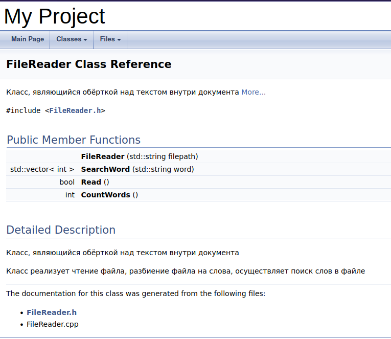
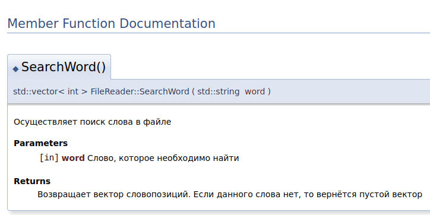
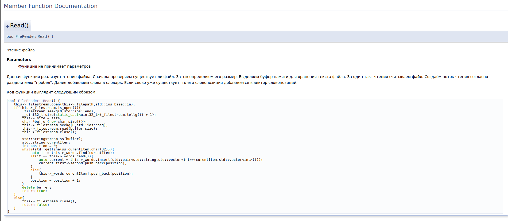
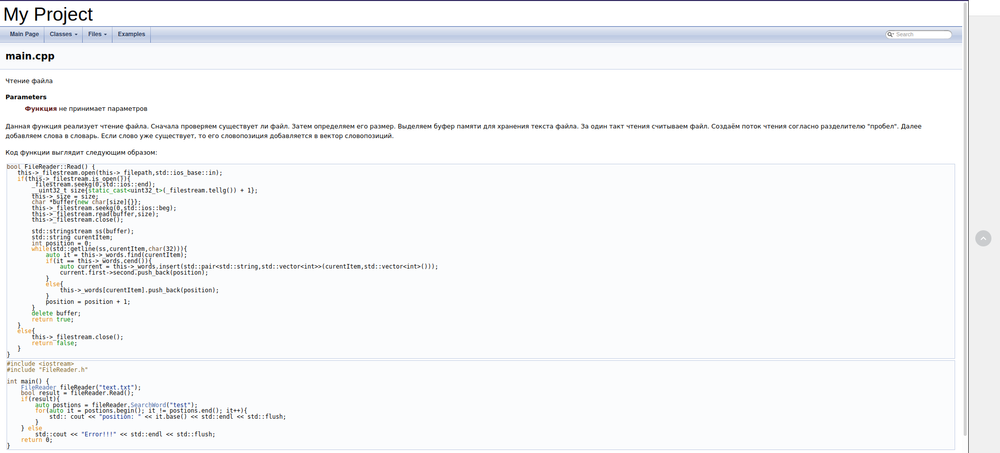

## Задание №9

## Документирование ПО

### Зависимости: [Задание 1][task-1], [VM][task-vm], [Задание 5][task-5], [Задание 7][task-7], [REPO][task-repo].

**Doxygen** - представляет собой средство автогенерации документации. Документация необходима в следующих случаях:

- **Командная разработка**. При совместной разработке другой член команды может вообще не знать реализации конкретной функции и того, что происходит внутри с точки зрения программного кода, но по описанию из документации становится понятно, что делает данная функция, какие параметры она принимает, возможные исключения в ходе работы, ожидаемый выходной результат.
- **Вы являетесь разработчиком модулей, которые предоставляются другим пользователя в пользование**. В отличие от случая выше, у пользователей нет никакой возможности связаться с вами. Ваша документация должна помогать пользователю писать максимально эффективный код.
- **Документация своих проектов**. Писать одно и то же миллиарды раз в корне не верно. Достаточно один раз реализовать какой-то функционал в формате библиотеки классов или готового проекта, задокументировать его и пользоваться в дальнейшем. Тем более если через полгода необходимо будет внести исправления, то тратить время на "воспоминания" не нужно, достаточно обратиться к документации.

Таким образом, всегда необходимо использовать средства документирования кода. Написание отдельно кода и документации может требовать дополнительного времени, особенно если приходится просто "переписывать" участки кода в документацию. Это трата времени. Тот же самый результат может быть получен путем автоматической генерации документации из кода, к тому же, это позволит в дальнейшем вносить изменения сразу из кода в документацию, без риска забыть или пропустить изменения. Надо лишь правильно комментировать код, чтобы средства автоматизации создания документации поняли комментарии и преобразовали в документацию. Таким образом можно убить двух зайцев - получить хорошие комментарии в коде и всегда актуальную, соответствующую коду документацию.

## Проверка и установка необходимого программного обеспечения

Для выполнения задания необходимо наличие пограммнго обеспечения doxygen.

```bash
apt list --installed doxygen
apt list --installed doxygen-gui
apt list --installed graphviz
```
Если выданная информация содержит название пакетов и фразу `installed` или `установлен`, то библиотека установлена и можно переходить к выполнению задания

В противном случае необходимо установить пакеты командой

```bash
sudo apt-get install doxygen
sudo apt-get install doxygen-gui
sudo apt-get install graphviz
```
В первой строке мы устанавливаем ядро приложения, позволяющее взаимодействовать с ним. Во второй происходит установка графической оболочки для ядра приложения. В третьей строке устанавливается средство, которое doxygen использует для визуализации графов и диаграмм.

Если происходит ошибка, связанная с отсутствием источников обновлений, необходимо их настроить для внутренней сети - файл [task_repo_prepare.md][task-repo], и повторить установку библиотеки.

Запустить графическую оболочку можно, набрав в консоли её название 

```bash
doxywizard
```

## Описание работы Doxygen

Doxygen генерирует документацию по файлу конфигурации. Файл конфигурации создаётся отдельно для каждого проекта. В файле конфигурации задаются такие параметры, как:

| Тэг | Назначение | Значения по умолчанию |
| ------ | ------ | ---------------------- |
| DOXYFILE_ENCODING | Кодировка, которая используется для всех символов в данном файле настроек | UTF-8  |
| OUTPUT_LANGUAGE | Устанавливает язык, на котором будет сгенерирована документация | English |
| PROJECT_NAME | Название проекта, которое может представлять собой единое слово или последовательность слов (если вы редактируете вне Doxywizard, последовательность слов необходимо поместить в двойные кавычки) | My Project |
| PROJECT_NUMBER | Данный тэг может быть использован для указания номера проекта или его версии | - |
| PROJECT_BRIEF  | Краткое однострочное описание проекта, которое размещается сверху каждой страницы и даёт общее представление о назначении проекта | - |
| OUTPUT_DIRECTORY |  	Абсолютный или относительный путь, по которому будет сгенерирована документация | Текущая директория |
| INPUT | Список файлов и/или директорий, разделенных пробелом, которые содержат в себе исходные коды проекта | Текущая директория |
| RECURSIVE | Используется в том случае, если необходимо сканировать исходные коды в подпапках указанных директорий | NO |

Вы можете взаимодействовать с `doxygen` как с помощью консоли, так и с помощью графической оболочки. Графическая оболочка облегчает взаимодействие с файлом конфигурации. По завершении работы с графической оболочкой будет создан файл конфигурации.

### Начало работы

Работы вести в каталоге `task9` вашего проекта (если не указано иное).

В качестве тестового проекта создадим новый проект, который будет осуществлять чтение файлов и реализовывать базовые операции над ними.

Исходный код файла **FileReader.h**
```c++
#ifndef EXAMPLEFILEREADER_FILEREADER_H

#include <string>
#include <iostream>
#include <fstream>
#include <vector>
#include <map>
class FileReader {
private:
    std::string _filepath;

    int _size;

    std::string _extension;

    std::ifstream _filestream;

    std::map<std::string, std::vector<int>> _words;


public:
    FileReader(std::string filepath);

    std::vector<int> SearchWord(std::string word);

    bool Read();

    int CountWords();

};


#endif //EXAMPLEFILEREADER_FILEREADER_H
```

Исходный код файла **FileReader.cpp**

```c++
#include "FileReader.h"
#include <sstream>
#include <vector>
std::vector<int> FileReader::SearchWord(std::string word) {
    auto it = this->_words.find(word);
    if(it == this->_words.cend())
        return  std::vector<int>();
    else
        return it->second;
}

bool FileReader::Read() {
    this->_filestream.open(this->_filepath,std::ios_base::in);
    if(this->_filestream.is_open()){
        _filestream.seekg(0,std::ios::end);
        __uint32_t size{static_cast<uint32_t>(_filestream.tellg()) + 1};
        this->_size = size;
        char *buffer{new char[size]{}};
        this->_filestream.seekg(0,std::ios::beg);
        this->_filestream.read(buffer,size);
        this->_filestream.close();

        std::stringstream ss(buffer);
        std::string curentItem;
        int position = 0;
        while(std::getline(ss,curentItem,char(32))){
            auto it = this->_words.find(curentItem);
            if(it == this->_words.cend()){
                auto current = this->_words.insert(std::pair<std::string,std::vector<int>>(curentItem,std::vector<int>()));
                current.first->second.push_back(position);
            }
            else{
                this->_words[curentItem].push_back(position);
            }
            position = position + 1;
        }
        delete buffer;
        return true;
    }
    else{
        this->_filestream.close();
        return false;
    }
}

FileReader::FileReader(std::string filepath) {
    this->_filepath = filepath;
}

int FileReader::CountWords() {
    int count = 0;

    for(auto it = this->_words.begin(); it!= this->_words.end(); it++){
        count += it->second.size();
    }
    return count;
}
```
#### Однострочный блок

Для описания однострочного блока опять же существует целый ряд способов оформления, рассмотрим два из них:
1. Можно использовать специальный комментарий в C++ стиле: ``` /// краткое описание ```
2. Можно использовать аналогичный предыдущему комментарий, только вместо дополнительного слеша в нем ставится восклицательный знак: ``` //! краткое описание ```

При этом хотелось бы обратить внимание на два момента:
1. Для указания подробного описания в однострочном документирующем блоке может быть использована команда `\details`: ``` /// \details ```
2. Документирующие блоки, следующие друг за другом, объединяются в один (причем вне зависимости от используемого стиля и того, являются они многострочными или однострочными). 
Например следующие два способа документирования дадут один и тот же результат:
```c++
/// \brief Краткое описание
/// \details Подробное описание
```
```c++
/// Краткое описание
/*!
    Подробное описание
*/
```

В рамках одного проекта следует всегда использовать только один единообразный стиль.

#### Размещение документирующего блока после элемента

Во всех предыдущих примерах подразумевалось, что документирующий блок предварял документируемый элемент, но иногда бывают ситуации, когда удобнее разместить его после документируемого элемента. Для этого необходимо в блок добавить маркер "<", как в примере ниже:
```c++
int variable; ///< Краткое описание
```

#### Пример документации 
Теперь рассмотрим то, как это будет выглядеть на практике. Ниже представлен документированный код класса **FileReader** в соответствии с правилами, рассмотреными ранее:
```c++
/*!
	\brief Класс, являющийся обёрткой над текстом внутри документа

	Класс реализует чтение файла, разбиение файла на слова, осуществляет поиск слов в файле
*/
class FileReader {

};
```
После добавления коментария в соответствующий класс и сохранения изменений в проекте запустите графическую оболочку `doxygen`. Нажмите кнопку `Select`, выберите путь до базой директории проекта. Перейдите на вкладку `Run`. С помощью кнопки `Show configuration` вы можете просмотреть сгенерированный файл конфигурации. С помощью кнопки `Run doxygen` запустите генерацию документации. Просмотреть сгенерированную документацию можно с помощью `Show HTML output`. На основе текущего проекта будет сгенерирована следующая документация. 



#### Документирование файлов

Хорошей практикой является добавление в начало файла документирующего блока, описывающегося его назначение. Для того, чтобы указать, что данный блок относится к файлу, необходимо воспользоваться командой `\file` (причём в качестве параметра можно указать путь к файлу, к которому относится данный блок, но по умолчанию выбирается тот файл, в который блок добавляется, что, как правило, соответствует нашим нуждам).
```c++
/*!
\file
\brief Заголовочный файл с описанием классов

Данный файл содержит в себе определения основных 
классов, используемых в демонстрационной программе
*/
#ifndef EXAMPLEFILEREADER_FILEREADER_H
#define EXAMPLEFILEREADER_FILEREADER_H

...

#endif // EXAMPLEFILEREADER_FILEREADER_H
``` 
#### Документирование функций и методов
При документировании функций и методов чаще всего необходимо указать входные параметры, возвращаемое функцией значение, а также возможные исключения. Рассмотрим последовательно соответствующие команды.

##### Параметры
Для указания параметров необходимо использовать команду `\param` для каждого из параметров функции, при этом синтаксис команды имеет следующий вид:
`\param [<направление>] <имя_параметра> {описание_параметра}`
Рассмотрим значение компонентов команды:
1. **Имя параметра** – это имя, под которым данный параметр известен в документируемом коде;
2. **Описание параметра** представляет собой простое текстовое описание используемого параметра..
3. **Направление** – это опциональный атрибут, который показывает назначение параметра и может иметь три значения "[in]", "[out]", "[in,out]";
##### Возвращаемое значение

Для описания возвращаемого значения используется команда `\return` (или её аналог `\returns`). Приведём пример использование параметров: `\return Описание возвращаемого значения`

Приведём пример описания функции:
```c++
/*!
    * Осуществляет поиск слова в файле
    * \param[in] word Слово, которое необходимо найти
    * @return Возвращает вектор словопозиций. Если данного слова нет, то вернётся пустой вектор
*/
std::vector<int> SearchWord(std::string word);
```
На основе этого комментария будет сгенерирована следующее описание:

 
 
#### Код внутри документации
Зачастую внутри пояснения к документации необходимо для примера добавить какой-то код, например для иллюстрации работы функции.

##### Команды `\code` и `\endcode`
Один из наиболее простых и универсальных способов сделать это – команды `\code` и `\endcode`, которые применяются следующим образом:
```c++
/*!
    \code [ {<расширение>} ]
        ...
    \endcode
*/
```

Используемый язык определяется автоматически в зависимости от расширения файла, в котором располагается документирующий блок, однако в случае, если такое поведение не соответствует ожиданиям, расширение можно указать явно.

Пример использования:
```c++
 /*!
     \brief Чтение файла
     \param Функция не принимает параметров

     Данная функция реализует чтение файла. Сначала проверяем, существует ли файл. Затем определяем его размер.
     Выделяем буфер памяти для хранения текста файла. За один такт чтения считываем файл.
     Создаём поток чтения согласно разделителю "пробел". Далее добавляем слова в словарь. Если слово уже существует,
     то его словопозиция добавляется в вектор словопозиций.

     Код функции выглядит следующим образом:
     \code
     bool FileReader::Read() {
        this->_filestream.open(this->_filepath,std::ios_base::in);
        if(this->_filestream.is_open()){
            _filestream.seekg(0,std::ios::end);
            __uint32_t size{static_cast<uint32_t>(_filestream.tellg()) + 1};
            this->_size = size;
            char *buffer{new char[size]{}};
            this->_filestream.seekg(0,std::ios::beg);
            this->_filestream.read(buffer,size);
            this->_filestream.close();

            std::stringstream ss(buffer);
            std::string curentItem;
            int position = 0;
            while(std::getline(ss,curentItem,char(32))){
                auto it = this->_words.find(curentItem);
                if(it == this->_words.cend()){
                    auto current = this->_words.insert(std::pair<std::string,std::vector<int>>(curentItem,std::vector<int>()));
                    current.first->second.push_back(position);
                }
                else{
                    this->_words[curentItem].push_back(position);
                }
                position = position + 1;
            }
            delete buffer;
            return true;
        }
        else{
            this->_filestream.close();
            return false;
        }
     }
     \endcode
*/
    bool Read();
```
На основе текущего описания будет сгенерирована следующая документация:


##### Примеры кода
Иногда удобнее примеры использования кода хранить в отдельных файлах. Для этого эти файлы необходимо разместить в отдельной директории и прописать к ней путь в настройках:
`EXAMPLE_PATH = путь_к_директории`  
Рассмотрим, некоторые способы того, как примеры кода могут быть использованы в документации.
Для установки с помощью графического интерфейса необходимо открыть вкладку `Expert`, Пункт `Input`, справа найти Переменную **EXAMPLE_PATH** и добавить ссылку на директорию исходного кода.
##### Команда `\example`
Данная команда показывает, что документирующий блок относится к примеру кода. 
Текст исходного кода будет добавлен в раздел «примеры», а исходный код примера будет проверен на наличие документированных элементов, и если таковые будут найдены, то к ним в описание будет добавлена ссылка на пример.
Таким образом, в документации у вас появится новая вкладка Examples. Она будет выглядеть следующим образом.




### Задание

Провести документирование программы, реализованной в рамках `task7` (новый файл с кодом не создавать, проводить изменение текущего кода задания `task7`, **результат - документация должна быть в каталоге `task9`**).


[task-1]: ./task1.md
[task-5]: ./task5.md
[task-7]: ./task7.md
[task-vm]: ./task_vm_prepare.md
[task-repo]: ./task_repo_prepare.md